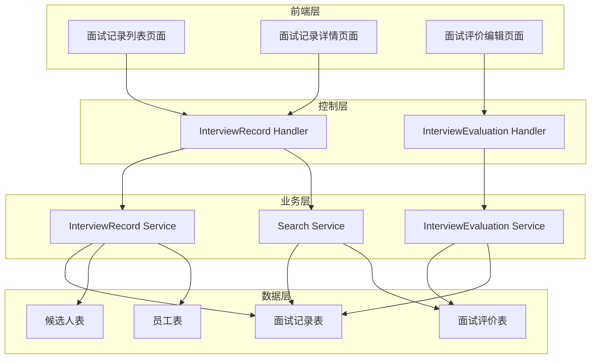

# 架构设计文档 - 面试记录功能

## 1. 架构概述

### 1.1 架构目标

* **可扩展性**: 支持面试记录功能的灵活扩展，能够适应不同类型的面试评价需求
* **高可用性**: 确保面试记录数据的可靠性和系统的稳定运行
* **可维护性**: 采用模块化设计，便于后续功能迭代和维护

### 1.2 架构原则

* **单一职责原则**: 每个模块专注于特定的功能领域
* **开闭原则**: 对扩展开放，对修改关闭
* **依赖倒置原则**: 高层模块不依赖低层模块，依赖抽象而非具体实现

## 2. 系统架构

### 2.1 整体架构图



### 2.2 架构分层

#### 2.2.1 表示层

* **面试记录列表页面**: 展示面试记录概要信息，提供搜索和筛选功能
* **面试记录详情页面**: 展示面试详细信息，包括评价信息
* **面试评价编辑页面**: 提供面试评价的编辑界面

#### 2.2.2 业务层

* **面试记录服务**: 负责面试记录的CRUD操作
* **面试评价服务**: 负责面试评价的管理和历史版本控制
* **搜索服务**: 提供按候选人和面试官名称的搜索功能

#### 2.2.3 数据层

* **面试记录表**: 存储面试基本信息
* **面试评价表**: 存储面试评价信息
* **候选人表**: 关联候选人信息
* **员工表**: 关联面试官信息

## 3. 服务设计

### 3.1 服务拆分

| 服务名称 | 职责 | 技术栈 | 数据库 |
|----------|------|--------|--------|
| 面试记录服务 | 面试记录的创建、查看、编辑 | Go + Gin | SQLite |
| 面试评价服务 | 面试评价的管理、历史版本控制 | Go + Gin | SQLite |
| 搜索服务 | 按候选人和面试官名称搜索 | Go + Gin | SQLite |

### 3.2 服务间通信

#### 3.2.1 同步通信

* **协议**: REST API
* **数据格式**: JSON
* **认证方式**: Cookie-based认证

### 3.3 API设计

#### 3.3.1 面试记录管理API

* **URL**: `/api/v1/interview-record`

* **Method**: POST
* **描述**: 创建面试记录
* **请求参数**:
  ```json
  {
    "candidate_id": "string",
    "interviewer_id": "string",
    "interview_time": "string",
    "interview_location": "string",
    "interview_type": "string"
  }
  ```
* **响应格式**:
  ```json
  {
    "code": 200,
    "data": {
      "interview_record_id": "string"
    },
    "message": "成功"
  }
  ```

* **URL**: `/api/v1/interview-record/{id}`

* **Method**: GET
* **描述**: 获取面试记录详情
* **响应格式**:
  ```json
  {
    "code": 200,
    "data": {
      "interview_record_id": "string",
      "candidate_id": "string",
      "candidate_name": "string",
      "interviewer_id": "string",
      "interviewer_name": "string",
      "interview_time": "string",
      "interview_location": "string",
      "interview_type": "string",
      "evaluations": []
    },
    "message": "成功"
  }
  ```

* **URL**: `/api/v1/interview-record/search`

* **Method**: GET
* **描述**: 搜索面试记录
* **请求参数**:
  ```json
  {
    "candidate_name": "string",
    "interviewer_name": "string",
    "page": 1,
    "limit": 20
  }
  ```
* **响应格式**:
  ```json
  {
    "code": 200,
    "data": {
      "total": 100,
      "records": []
    },
    "message": "成功"
  }
  ```

#### 3.3.2 面试评价管理API

* **URL**: `/api/v1/interview-evaluation`

* **Method**: POST
* **描述**: 创建面试评价
* **请求参数**:
  ```json
  {
    "interview_record_id": "string",
    "professional_score": 5,
    "communication_score": 5,
    "teamwork_score": 5,
    "overall_score": 5,
    "text_evaluation": "string"
  }
  ```
* **响应格式**:
  ```json
  {
    "code": 200,
    "data": {
      "evaluation_id": "string"
    },
    "message": "成功"
  }
  ```

* **URL**: `/api/v1/interview-evaluation/{id}`

* **Method**: PUT
* **描述**: 更新面试评价
* **请求参数**:
  ```json
  {
    "professional_score": 5,
    "communication_score": 5,
    "teamwork_score": 5,
    "overall_score": 5,
    "text_evaluation": "string"
  }
  ```
* **响应格式**:
  ```json
  {
    "code": 200,
    "data": {
      "evaluation_id": "string"
    },
    "message": "成功"
  }
  ```

## 4. 数据架构

### 4.1 数据存储策略

* **关系型数据库**: SQLite，用于存储结构化的面试记录和评价数据
* **数据关联**: 通过外键关联面试记录、评价、候选人和员工信息

### 4.2 数据库设计

#### 4.2.1 面试记录表 (interview_record)

```sql
CREATE TABLE `interview_record` (
    `id` INTEGER PRIMARY KEY AUTOINCREMENT,
    `interview_record_id` varchar(32) NOT NULL,
    `candidate_id` varchar(32) NOT NULL,
    `interviewer_id` varchar(32) NOT NULL,
    `interview_time` datetime NOT NULL,
    `interview_location` varchar(100) NOT NULL,
    `interview_type` varchar(32) NOT NULL,
    `status` int NOT NULL DEFAULT 0,
    `created_at` datetime DEFAULT NULL,
    `updated_at` datetime DEFAULT NULL,
    `deleted_at` datetime DEFAULT NULL
);
```

#### 4.2.2 面试评价表 (interview_evaluation)

```sql
CREATE TABLE `interview_evaluation` (
    `id` INTEGER PRIMARY KEY AUTOINCREMENT,
    `evaluation_id` varchar(32) NOT NULL,
    `interview_record_id` varchar(32) NOT NULL,
    `professional_score` int NOT NULL,
    `communication_score` int NOT NULL,
    `teamwork_score` int NOT NULL,
    `overall_score` int NOT NULL,
    `text_evaluation` text,
    `version` int NOT NULL DEFAULT 1,
    `evaluator_id` varchar(32) NOT NULL,
    `created_at` datetime DEFAULT NULL,
    `updated_at` datetime DEFAULT NULL,
    `deleted_at` datetime DEFAULT NULL
);
```

#### 4.2.3 面试评价历史表 (interview_evaluation_history)

```sql
CREATE TABLE `interview_evaluation_history` (
    `id` INTEGER PRIMARY KEY AUTOINCREMENT,
    `history_id` varchar(32) NOT NULL,
    `evaluation_id` varchar(32) NOT NULL,
    `professional_score` int NOT NULL,
    `communication_score` int NOT NULL,
    `teamwork_score` int NOT NULL,
    `overall_score` int NOT NULL,
    `text_evaluation` text,
    `version` int NOT NULL,
    `evaluator_id` varchar(32) NOT NULL,
    `created_at` datetime DEFAULT NULL
);
```

### 4.3 数据一致性

* **强一致性场景**: 面试记录和评价的创建、更新操作
* **最终一致性场景**: 搜索索引的更新

## 5. 前端页面设计

### 5.1 面试记录列表页面

* **页面路径**: `/views/interview_record_manage.html`
* **主要功能**:
  - 显示面试记录列表（候选人姓名、面试官姓名、面试时间、面试状态）
  - 搜索功能（按候选人名称、面试官名称）
  - 筛选功能（按面试时间、面试类型）
  - 分页显示
  - 操作按钮（查看详情、编辑评价）

### 5.2 面试记录详情页面

* **页面路径**: `/views/interview_record_detail.html`
* **主要功能**:
  - 显示面试基本信息（时间、地点、类型、参与人员）
  - 显示面试评价信息（各维度评分、文字评价）
  - 显示评价修改历史
  - 编辑按钮（有权限时显示）

### 5.3 面试评价编辑页面

* **页面路径**: `/views/interview_evaluation_edit.html`
* **主要功能**:
  - 多维度评分输入（专业技能、沟通能力、团队协作、总体评价）
  - 富文本编辑器（文字评价）
  - 保存和取消按钮
  - 暂存功能

## 6. 模块划分和职责

### 6.1 后端模块

#### 6.1.1 Model层

* **InterviewRecord**: 面试记录数据模型
* **InterviewEvaluation**: 面试评价数据模型
* **InterviewEvaluationHistory**: 面试评价历史数据模型

#### 6.1.2 Service层

* **InterviewRecordService**: 面试记录业务逻辑
* **InterviewEvaluationService**: 面试评价业务逻辑
* **SearchService**: 搜索业务逻辑

#### 6.1.3 Handler层

* **InterviewRecordHandler**: 面试记录HTTP处理
* **InterviewEvaluationHandler**: 面试评价HTTP处理

### 6.2 前端模块

* **面试记录列表组件**: 负责列表展示和搜索
* **面试记录详情组件**: 负责详情展示
* **面试评价编辑组件**: 负责评价编辑

## 7. 技术选型

### 7.1 后端技术栈

* **编程语言**: Go 1.23.0
* **Web框架**: Gin
* **ORM框架**: GORM
* **数据库**: SQLite
* **认证**: Cookie-based认证

### 7.2 前端技术栈

* **UI框架**: Layui
* **JavaScript**: 原生JS
* **CSS**: Layui CSS
* **富文本编辑器**: Layui编辑器组件

### 7.3 技术选型理由

* **Go语言**: 性能优秀，并发处理能力强，适合Web应用开发
* **Gin框架**: 轻量级，性能好，API开发友好
* **GORM**: 功能强大的ORM框架，支持多种数据库
* **SQLite**: 轻量级数据库，无需额外配置，适合中小型应用
* **Layui**: 简单易用的前端框架，与现有项目保持一致

## 8. 集成方案

### 8.1 与现有系统集成

* **数据库集成**: 使用现有的SQLite数据库，创建新的表结构
* **认证集成**: 复用现有的Cookie-based认证机制
* **权限集成**: 利用现有的权限管理系统，控制不同角色的访问权限
* **前端集成**: 使用现有的Layui框架和样式，保持界面一致性

### 8.2 数据流设计

1. **面试记录创建流程**:
   - 用户选择候选人和面试官
   - 填写面试基本信息
   - 系统创建面试记录
   - 关联候选人和面试官信息

2. **面试评价流程**:
   - 面试官查看面试记录
   - 填写多维度评分和文字评价
   - 系统保存评价信息
   - 记录评价历史版本

3. **搜索流程**:
   - 用户输入搜索条件
   - 系统查询面试记录和评价数据
   - 返回搜索结果
   - 展示搜索结果列表

### 8.3 权限控制

* **招聘管理员**: 查看所有面试记录、编辑所有面试评价、创建面试记录
* **面试官**: 查看自己参与的面试记录、编辑自己负责的面试评价
* **部门经理**: 查看本部门相关的面试记录