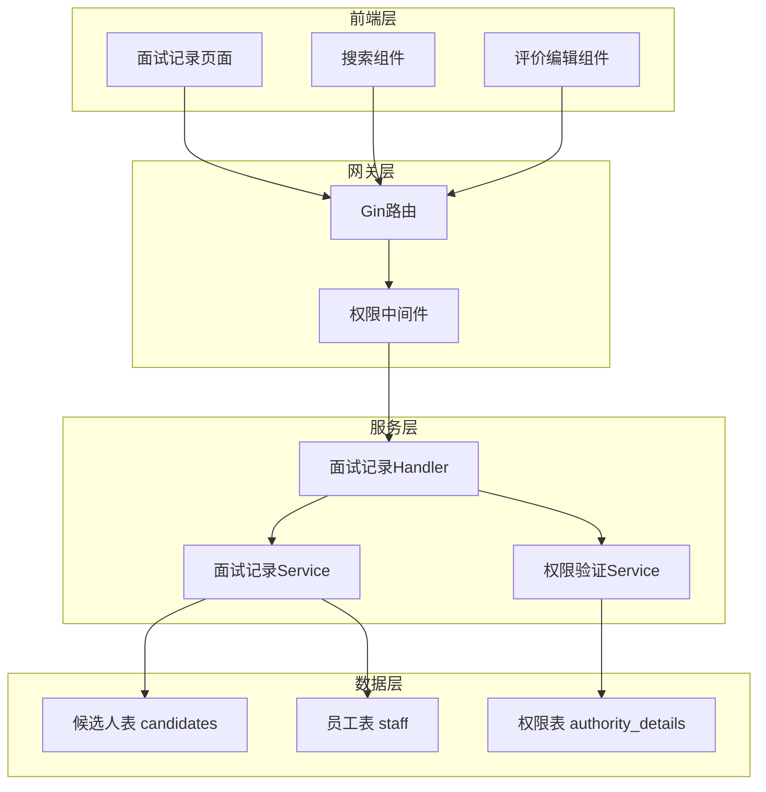

# 技术设计文档 - 面试记录页面

## 1. 架构概述

### 1.1 架构目标
- **可扩展性**: 基于现有HRMS架构，支持面试记录功能的平滑扩展
- **高可用性**: 继承现有系统的稳定性和可靠性
- **可维护性**: 遵循现有代码规范，便于后续维护和功能扩展

### 1.2 架构原则
- 单一职责原则：面试记录功能独立封装
- 开闭原则：对扩展开放，对修改封闭
- 依赖倒置原则：依赖抽象而非具体实现
- 接口隔离原则：提供精简的API接口
- 数据一致性原则：确保候选人与面试官数据关联的准确性

## 2. 系统架构

### 2.1 整体架构图



### 2.2 架构分层

#### 2.2.1 表示层
- **面试记录页面**: 基于LayUI框架的响应式页面
- **搜索组件**: 候选人姓名和面试官姓名的模糊搜索
- **评价编辑组件**: 面试评价的在线编辑功能

#### 2.2.2 业务层
- **Handler层**: 处理HTTP请求和响应
- **Service层**: 实现业务逻辑和数据处理
- **权限验证**: 基于Cookie的鉴权和细粒度权限控制

#### 2.2.3 数据层
- **现有数据表**: 复用candidates和staff表
- **关联查询**: 通过staff_id关联候选人和面试官
- **权限数据**: 基于authority_details表的权限控制

## 3. 数据架构

### 3.1 数据模型设计

#### 3.1.1 面试记录视图模型
```go
// InterviewRecordVO 面试记录视图对象
type InterviewRecordVO struct {
    ID              uint      `json:"id"`
    CandidateId     string    `json:"candidate_id"`
    CandidateName   string    `json:"candidate_name"`
    JobName         string    `json:"job_name"`
    EduLevel        string    `json:"edu_level"`
    Major           string    `json:"major"`
    Experience      string    `json:"experience"`
    Email           string    `json:"email"`
    InterviewerID   string    `json:"interviewer_id"`
    InterviewerName string    `json:"interviewer_name"`
    DepName         string    `json:"dep_name"`
    RankName        string    `json:"rank_name"`
    Evaluation      string    `json:"evaluation"`
    Status          int64     `json:"status"`
    StatusText      string    `json:"status_text"`
    CreatedAt       time.Time `json:"created_at"`
    UpdatedAt       time.Time `json:"updated_at"`
}
```

#### 3.1.2 面试评价编辑DTO
```go
// InterviewEvaluationDTO 面试评价编辑数据传输对象
type InterviewEvaluationDTO struct {
    CandidateID uint   `json:"candidate_id" binding:"required"`
    Evaluation  string `json:"evaluation" binding:"required,max=1000"`
}
```

#### 3.1.3 搜索查询DTO
```go
// InterviewSearchDTO 面试记录搜索数据传输对象
type InterviewSearchDTO struct {
    CandidateName   string `json:"candidate_name"`
    InterviewerName string `json:"interviewer_name"`
    Status          int64  `json:"status"`
    Page            int    `json:"page"`
    Limit           int    `json:"limit"`
}
```

### 3.2 数据存储策略
- **主数据源**: 现有的candidates和staff表
- **关联查询**: 通过LEFT JOIN实现候选人与面试官信息的关联
- **索引优化**: 在candidates.staff_id和candidates.name字段上建立索引

### 3.3 数据一致性
- **强一致性场景**: 面试评价的更新操作
- **最终一致性场景**: 面试记录列表的查询展示

## 4. API接口设计

### 4.1 面试记录列表查询
- **URL**: `/interview/records`
- **Method**: GET
- **描述**: 获取面试记录列表，支持分页和搜索
- **请求参数**:
  ```json
  {
    "candidate_name": "候选人姓名（可选）",
    "interviewer_name": "面试官姓名（可选）",
    "status": "面试状态（可选）",
    "page": 1,
    "limit": 15
  }
  ```
- **响应格式**:
  ```json
  {
    "status": 2000,
    "total": 100,
    "msg": [
      {
        "id": 1,
        "candidate_id": "candidate_001",
        "candidate_name": "张三",
        "job_name": "软件工程师",
        "interviewer_name": "李四",
        "dep_name": "技术部",
        "evaluation": "表现良好",
        "status": 1,
        "status_text": "待面试"
      }
    ]
  }
  ```

### 4.2 面试评价更新
- **URL**: `/interview/evaluation`
- **Method**: PUT
- **描述**: 更新候选人的面试评价
- **请求参数**:
  ```json
  {
    "candidate_id": 1,
    "evaluation": "候选人技术能力强，沟通表达清晰，建议录用"
  }
  ```
- **响应格式**:
  ```json
  {
    "status": 2000,
    "message": "更新成功"
  }
  ```

### 4.3 面试记录详情查询
- **URL**: `/interview/record/:id`
- **Method**: GET
- **描述**: 获取单个候选人的详细面试记录
- **响应格式**:
  ```json
  {
    "status": 2000,
    "msg": {
      "id": 1,
      "candidate_name": "张三",
      "job_name": "软件工程师",
      "edu_level": "本科",
      "major": "计算机科学",
      "experience": "3年",
      "interviewer_name": "李四",
      "dep_name": "技术部",
      "rank_name": "高级工程师",
      "evaluation": "详细评价内容",
      "status": 2,
      "status_text": "面试完成"
    }
  }
  ```

## 5. 前端架构设计

### 5.1 页面结构设计
```html
<!-- 面试记录管理页面结构 -->
<div class="layuimini-container">
    <!-- 搜索区域 -->
    <fieldset class="table-search-fieldset">
        <form class="layui-form layui-form-pane">
            <div class="layui-inline">
                <label>候选人姓名</label>
                <input type="text" name="candidate_name" class="layui-input">
            </div>
            <div class="layui-inline">
                <label>面试官姓名</label>
                <input type="text" name="interviewer_name" class="layui-input">
            </div>
            <button type="submit" class="layui-btn">搜索</button>
        </form>
    </fieldset>
    
    <!-- 数据表格 -->
    <table id="interviewTable" lay-filter="interviewTableFilter"></table>
</div>
```

### 5.2 JavaScript架构
```javascript
// 面试记录页面主要功能模块
layui.use(['table', 'form', 'layer'], function(){
    var table = layui.table;
    var form = layui.form;
    var layer = layui.layer;
    
    // 表格初始化
    var interviewTable = table.render({
        elem: '#interviewTable',
        url: '/interview/records',
        cols: [[
            {field: 'candidate_name', title: '候选人姓名'},
            {field: 'job_name', title: '应聘岗位'},
            {field: 'interviewer_name', title: '面试官'},
            {field: 'dep_name', title: '部门'},
            {field: 'status_text', title: '面试状态'},
            {title: '操作', toolbar: '#barDemo'}
        ]],
        page: true,
        limit: 15
    });
    
    // 搜索功能
    form.on('submit(search-btn)', function(data){
        table.reload('interviewTable', {
            where: data.field,
            page: {curr: 1}
        });
        return false;
    });
    
    // 工具栏事件
    table.on('tool(interviewTableFilter)', function(obj){
        var data = obj.data;
        if(obj.event === 'edit_evaluation'){
            editEvaluation(data);
        } else if(obj.event === 'view_detail'){
            viewDetail(data);
        }
    });
});
```

### 5.3 组件设计

#### 5.3.1 搜索组件
- 支持候选人姓名和面试官姓名的模糊搜索
- 实时搜索，输入即查询
- 搜索条件持久化

#### 5.3.2 评价编辑组件
- 弹窗式编辑界面
- 富文本编辑器支持
- 字符数限制（1000字符）
- 权限控制：只能编辑自己负责的候选人

## 6. 权限控制设计

### 6.1 权限模型
基于现有的三级权限体系：
- **supersys**: 超级管理员，查看所有面试记录
- **sys**: 系统管理员，管理本分公司所有面试记录
- **normal**: 普通用户，只能查看和编辑自己负责的候选人

### 6.2 权限配置
在authority_details表中新增面试记录相关权限：

```sql
INSERT INTO authority_details (user_type, model, name, authority_content) VALUES
('supersys', 'interview_record', '面试记录管理', '查询、编辑所有面试记录'),
('sys', 'interview_record', '面试记录管理', '查询、编辑本分公司面试记录'),
('normal', 'interview_record', '面试记录管理', '查询面试记录，编辑自己负责的候选人评价');
```

### 6.3 权限验证逻辑
```go
// 权限验证中间件
func CheckInterviewPermission(c *gin.Context) {
    db := resource.HrmsDB(c)
    if db == nil {
        c.JSON(http.StatusUnauthorized, gin.H{"status": 401, "message": "Unauthorized"})
        c.Abort()
        return
    }
    
    // 获取用户信息
    userInfo := getUserFromContext(c)
    
    // 根据用户类型进行权限控制
    switch userInfo.UserType {
    case "supersys", "sys":
        // 管理员权限，允许访问
        c.Next()
    case "normal":
        // 普通用户权限，需要验证是否为负责的候选人
        candidateID := c.Param("candidate_id")
        if !isResponsibleForCandidate(db, userInfo.StaffID, candidateID) {
            c.JSON(http.StatusForbidden, gin.H{"status": 403, "message": "Forbidden"})
            c.Abort()
            return
        }
        c.Next()
    default:
        c.JSON(http.StatusForbidden, gin.H{"status": 403, "message": "Forbidden"})
        c.Abort()
    }
}
```

## 7. 技术实现方案

### 7.1 后端实现

#### 7.1.1 Handler层实现
```go
// handler/interview.go
package handler

import (
    "hrms/model"
    "hrms/service"
    "net/http"
    "strconv"
    
    "github.com/gin-gonic/gin"
)

// GetInterviewRecords 获取面试记录列表
func GetInterviewRecords(c *gin.Context) {
    // 参数解析
    searchDTO := model.InterviewSearchDTO{
        CandidateName:   c.Query("candidate_name"),
        InterviewerName: c.Query("interviewer_name"),
        Status:          parseIntParam(c.Query("status")),
    }
    start, limit := service.AcceptPage(c)
    
    // 业务处理
    records, total, err := service.GetInterviewRecords(c, &searchDTO, start, limit)
    if err != nil {
        c.JSON(200, gin.H{
            "status": 5000,
            "total":  0,
            "msg":    err.Error(),
        })
        return
    }
    
    c.JSON(200, gin.H{
        "status": 2000,
        "total":  total,
        "msg":    records,
    })
}

// UpdateInterviewEvaluation 更新面试评价
func UpdateInterviewEvaluation(c *gin.Context) {
    var dto model.InterviewEvaluationDTO
    if err := c.ShouldBindJSON(&dto); err != nil {
        c.JSON(200, gin.H{
            "status": 5001,
            "result": err.Error(),
        })
        return
    }
    
    err := service.UpdateInterviewEvaluation(c, &dto)
    if err != nil {
        c.JSON(200

    }
  }
  ```

## 5. 前端架构设计

### 5.1 页面结构设计
```html
<!-- 面试记录管理页面结构 -->
<div class="layuimini-container">
    <!-- 搜索区域 -->
    <fieldset class="table-search-fieldset">
        <form class="layui-form layui-form-pane">
            <div class="layui-inline">
                <label>候选人姓名</label>
                <input type="text" name="candidate_name" class="layui-input">
            </div>
            <div class="layui-inline">
                <label>面试官姓名</label>
                <input type="text" name="interviewer_name" class="layui-input">
            </div>
            <button type="submit" class="layui-btn">搜索</button>
        </form>
    </fieldset>
    
    <!-- 数据表格 -->
    <table id="interviewTable" lay-filter="interviewTableFilter"></table>
</div>
```

### 5.2 JavaScript架构
```javascript
// 面试记录页面主要功能模块
layui.use(['table', 'form', 'layer'], function(){
    var table = layui.table;
    var form = layui.form;
    var layer = layui.layer;
    
    // 表格初始化
    var interviewTable = table.render({
        elem: '#interviewTable',
        url: '/interview/records',
        cols: [[
            {field: 'candidate_name', title: '候选人姓名'},
            {field: 'job_name', title: '应聘岗位'},
            {field: 'interviewer_name', title: '面试官'},
            {field: 'dep_name', title: '部门'},
            {field: 'status_text', title: '面试状态'},
            {title: '操作', toolbar: '#barDemo'}
        ]],
        page: true,
        limit: 15
    });
    
    // 搜索功能
    form.on('submit(search-btn)', function(data){
        table.reload('interviewTable', {
            where: data.field,
            page: {curr: 1}
        });
        return false;
    });
    
    // 工具栏事件
    table.on('tool(interviewTableFilter)', function(obj){
        var data = obj.data;
        if(obj.event === 'edit_evaluation'){
            editEvaluation(data);
        } else if(obj.event === 'view_detail'){
            viewDetail(data);
        }
    });
});
```

### 5.3 组件设计

#### 5.3.1 搜索组件
- 支持候选人姓名和面试官姓名的模糊搜索
- 实时搜索，输入即查询
- 搜索条件持久化

#### 5.3.2 评价编辑组件
- 弹窗式编辑界面
- 富文本编辑器支持
- 字符数限制（1000字符）
- 权限控制：只能编辑自己负责的候选人

## 6. 权限控制设计

### 6.1 权限模型
基于现有的三级权限体系：
- **supersys**: 超级管理员，查看所有面试记录
- **sys**: 系统管理员，管理本分公司所有面试记录
- **normal**: 普通用户，只能查看和编辑自己负责的候选人

### 6.2 权限配置
在authority_details表中新增面试记录相关权限：

```sql
INSERT INTO authority_details (user_type, model, name, authority_content) VALUES
('supersys', 'interview_record', '面试记录管理', '查询、编辑所有面试记录'),
('sys', 'interview_record', '面试记录管理', '查询、编辑本分公司面试记录'),
('normal', 'interview_record', '面试记录管理', '查询面试记录，编辑自己负责的候选人评价');
```

### 6.3 权限验证逻辑
```go
// 权限验证中间件
func CheckInterviewPermission(c *gin.Context) {
    db := resource.HrmsDB(c)
    if db == nil {
        c.JSON(http.StatusUnauthorized, gin.H{"status": 401, "message": "Unauthorized"})
        c.Abort()
        return
    }
    
    // 获取用户信息
    userInfo := getUserFromContext(c)
    
    // 根据用户类型进行权限控制
    switch userInfo.UserType {
    case "supersys", "sys":
        // 管理员权限，允许访问
        c.Next()
    case "normal":
        // 普通用户权限，需要验证是否为负责的候选人
        candidateID := c.Param("candidate_id")
        if !isResponsibleForCandidate(db, userInfo.StaffID, candidateID) {
            c.JSON(http.StatusForbidden, gin.H{"status": 403, "message": "Forbidden"})
            c.Abort()
            return
        }
        c.Next()
    default:
        c.JSON(http.StatusForbidden, gin.H{"status": 403, "message": "Forbidden"})
        c.Abort()
    }
}
```

## 7. 技术实现方案

### 7.1 后端实现

#### 7.1.1 Handler层实现
```go
// handler/interview.go
package handler

import (
    "hrms/model"
    "hrms/service"
    "net/http"
    "strconv"
    
    "github.com/gin-gonic/gin"
)

// GetInterviewRecords 获取面试记录列表
func GetInterviewRecords(c *gin.Context) {
    // 参数解析
    searchDTO := model.InterviewSearchDTO{
        CandidateName:   c.Query("candidate_name"),
        InterviewerName: c.Query("interviewer_name"),
        Status:          parseIntParam(c.Query("status")),
    }
    start, limit := service.AcceptPage(c)
    
    // 业务处理
    records, total, err := service.GetInterviewRecords(c, &searchDTO, start, limit)
    if err != nil {
        c.JSON(200, gin.H{
            "status": 5000,
            "total":  0,
            "msg":    err.Error(),
        })
        return
    }
    
    c.JSON(200, gin.H{
        "status": 2000,
        "total":  total,
        "msg":    records,
    })
}

// UpdateInterviewEvaluation 更新面试评价
func UpdateInterviewEvaluation(c *gin.Context) {
    var dto model.InterviewEvaluationDTO
    if err := c.ShouldBindJSON(&dto); err != nil {
        c.JSON(200, gin.H{
            "status": 5001,
            "result": err.Error(),
        })
        return
    }
    
    err := service.UpdateInterviewEvaluation(c, &dto)
    if err != nil {
        if err == resource.ErrUnauthorized {
            c.JSON(http.StatusUnauthorized, gin.H{"status": 401, "message": "Unauthorized"})
            return
        }
        c.JSON(200, gin.H{
            "status": 5002,
            "result": err.Error(),
        })
        return
    }
    
    c.JSON(200, gin.H{
        "status": 2000,
        "message": "更新成功",
    })
}
```

#### 7.1.2 Service层实现
```go
// service/interview.go
package service

import (
    "hrms/model"
    "hrms/resource"
    "log"
    
    "github.com/gin-gonic/gin"
)

// GetInterviewRecords 获取面试记录列表
func GetInterviewRecords(c *gin.Context, searchDTO *model.InterviewSearchDTO, start, limit int) ([]model.InterviewRecordVO, int64, error) {
    db := resource.HrmsDB(c)
    if db == nil {
        log.Printf("GetInterviewRecords: 数据库连接为空，鉴权失败")
        return nil, 0, resource.ErrUnauthorized
    }
    
    // 构建查询
    query := db.Table("candidates c").
        Select(`c.id, c.candidate_id, c.name as candidate_name, c.job_name, 
                c.edu_level, c.major, c.experience, c.email, c.evaluation, c.status,
                s.staff_id as interviewer_id, s.staff_name as interviewer_name,
                d.dep_name, r.rank_name, c.created_at, c.updated_at`).
        Joins("LEFT JOIN staff s ON c.staff_id = s.staff_id").
        Joins("LEFT JOIN departments d ON s.dep_id = d.dep_id").
        Joins("LEFT JOIN ranks r ON s.rank_id = r.rank_id")
    
    // 添加搜索条件
    if searchDTO.CandidateName != "" {
        query = query.Where("c.name LIKE ?", "%"+searchDTO.CandidateName+"%")
    }
    if searchDTO.InterviewerName != "" {
        query = query.Where("s.staff_name LIKE ?", "%"+searchDTO.InterviewerName+"%")
    }
    if searchDTO.Status > 0 {
        query = query.Where("c.status = ?", searchDTO.Status)
    }
    
    // 权限控制
    userInfo := getUserFromContext(c)
    if userInfo.UserType == "normal" {
        query = query.Where("c.staff_id = ?", userInfo.StaffID)
    }
    
    // 获取总数
    var total int64
    query.Count(&total)
    
    // 分页查询
    var records []model.InterviewRecordVO
    err := query.Offset(start).Limit(limit).
        Order("c.updated_at DESC").
        Scan(&records).Error
    
    if err != nil {
        log.Printf("GetInterviewRecords err = %v", err)
        return nil, 0, err
    }
    
    // 处理状态文本
    for i := range records {
        records[i].StatusText = getStatusText(records[i].Status)
    }
    
    return records, total, nil
}

// UpdateInterviewEvaluation 更新面试评价
func UpdateInterviewEvaluation(c *gin.Context, dto *model.InterviewEvaluationDTO) error {
    db := resource.HrmsDB(c)
    if db == nil {
        log.Printf("UpdateInterviewEvaluation: 数据库连接为空，鉴权失败")
        return resource.ErrUnauthorized
    }
    
    // 权限验证：普通用户只能编辑自己负责的候选人
    userInfo := getUserFromContext(c)
    if userInfo.UserType == "normal" {
        var candidate model.Candidate
        err := db.Where("id = ? AND staff_id = ?", dto.CandidateID, userInfo.StaffID).
            First(&candidate).Error
        if err != nil {
            log.Printf("UpdateInterviewEvaluation: 权限验证失败，用户无权编辑此候选人")
            return resource.ErrUnauthorized
        }
    }
    
    // 更新评价
    err := db.Model(&model.Candidate{}).
        Where("id = ?", dto.CandidateID).
        Update("evaluation", dto.Evaluation).Error
    
    if err != nil {
        log.Printf("UpdateInterviewEvaluation err = %v", err)
        return err
    }
    
    return nil
}

// getStatusText 获取状态文本
func getStatusText(status int64) string {
    switch status {
    case 0:
        return "待面试"
    case 1:
        return "面试中"
    case 2:
        return "面试完成"
    case 3:
        return "已录用"
    case 4:
        return "已拒绝"
    default:
        return "未知状态"
    }
}
```

### 7.2 路由配置
```go
// main.go 中添加面试记录相关路由
func routerInit(server *gin.Engine) {
    // ... 现有路由配置 ...
    
    // 面试记录相关路由
    interviewGroup := server.Group("/interview")
    interviewGroup.GET("/records", handler.GetInterviewRecords)
    interviewGroup.PUT("/evaluation", handler.UpdateInterviewEvaluation)
    interviewGroup.GET("/record/:id", handler.GetInterviewRecordDetail)
}
```

### 7.3 前端菜单配置

#### 7.3.1 系统管理员菜单配置
在 `static/api/init_sys.json` 的招聘管理模块中添加：
```json
{
  "title": "面试记录",
  "href": "/authority_render/interview_record_manage",
  "icon": "fa fa-tachometer",
  "target": "_self"
}
```

#### 7.3.2 普通用户菜单配置
在 `static/api/init_normal.json` 的招聘管理模块中添加：
```json
{
  "title": "面试记录",
  "href": "/authority_render/normal_interview_record_manage",
  "icon": "fa fa-tachometer",
  "target": "_self"
}
```

## 8. 数据库优化建议

### 8.1 索引优化
```sql
-- 为提升查询性能，建议添加以下索引
CREATE INDEX idx_candidates_staff_id ON candidates(staff_id);
CREATE INDEX idx_candidates_name ON candidates(name);
CREATE INDEX idx_candidates_status ON candidates(status);
CREATE INDEX idx_staff_staff_name ON staff(staff_name);
```

### 8.2 查询优化
- 使用LEFT JOIN避免数据丢失
- 合理使用分页查询减少数据传输
- 对搜索条件进行预处理，避免SQL注入

## 9. 测试策略

### 9.1 单元测试
- Handler层接口测试
- Service层业务逻辑测试
- 权限验证逻辑测试

### 9.2 集成测试
- API接口完整性测试
- 数据库连接和查询测试
- 前后端数据交互测试

### 9.3 性能测试
- 并发访问测试（50用户）
- 页面加载时间测试（<2秒）
- 搜索响应时间测试（<1秒）

## 10. 部署和运维

### 10.1 部署要

### 10.1 部署要求
- 无需额外部署步骤，集成到现有HRMS系统
- 确保数据库权限配置正确
- 验证前端菜单配置生效

### 10.2 监控指标
- API响应时间监控
- 数据库查询性能监控
- 用户访问量统计
- 错误日志监控

## 11. 风险评估与应对

### 11.1 技术风险
| 风险项 | 风险等级 | 影响 | 应对措施 |
|--------|----------|------|----------|
| 数据库性能 | 中 | 查询响应慢 | 添加索引，优化查询语句 |
| 权限控制 | 高 | 数据泄露 | 严格测试权限验证逻辑 |
| 前端兼容性 | 低 | 部分浏览器显示异常 | 充分测试主流浏览器 |

### 11.2 业务风险
| 风险项 | 风险等级 | 影响 | 应对措施 |
|--------|----------|------|----------|
| 用户接受度 | 中 | 功能使用率低 | 提供用户培训和操作指南 |
| 数据一致性 | 高 | 面试记录错误 | 实施严格的数据验证 |

## 12. 实施计划

### 12.1 开发阶段
1. **第一阶段**（1-2天）：后端API开发
   - 实现Handler和Service层
   - 完成权限验证逻辑
   - 单元测试

2. **第二阶段**（1-2天）：前端页面开发
   - 创建面试记录管理页面
   - 实现搜索和编辑功能
   - 前端测试

3. **第三阶段**（1天）：集成测试
   - API接口测试
   - 权限控制测试
   - 性能测试

### 12.2 上线计划
1. 数据库索引优化
2. 权限配置更新
3. 前端菜单配置
4. 功能验证测试
5. 用户培训

## 13. 总结

### 13.1 设计亮点
- **架构一致性**：完全基于现有HRMS架构，无缝集成
- **权限精细化**：支持三级权限体系，确保数据安全
- **用户体验**：简洁直观的界面设计，符合用户操作习惯
- **性能优化**：合理的索引设计和查询优化，确保响应速度

### 13.2 技术特色
- **数据关联**：通过JOIN查询实现候选人与面试官信息的完整展示
- **搜索功能**：支持多维度模糊搜索，提升查询效率
- **权限控制**：基于Cookie鉴权和数据库权限的双重保障
- **响应式设计**：兼容多种设备和浏览器

### 13.3 扩展性考虑
- 预留面试流程管理接口
- 支持面试评价模板扩展
- 可扩展面试统计分析功能
- 支持面试记录导出功能

本设计方案在满足当前需求的同时，为未来功能扩展预留了充分的空间，确保系统的可持续发展。