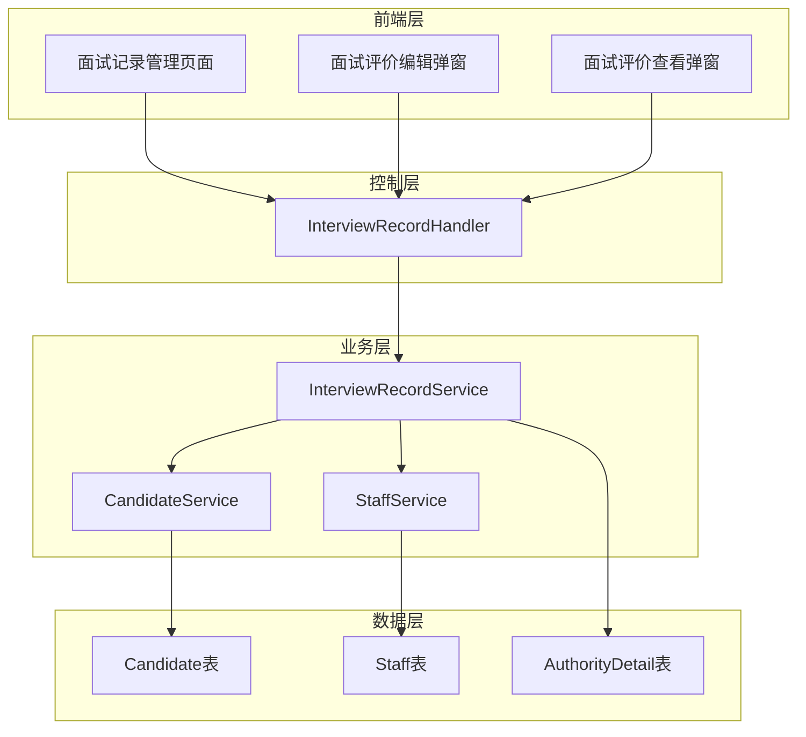
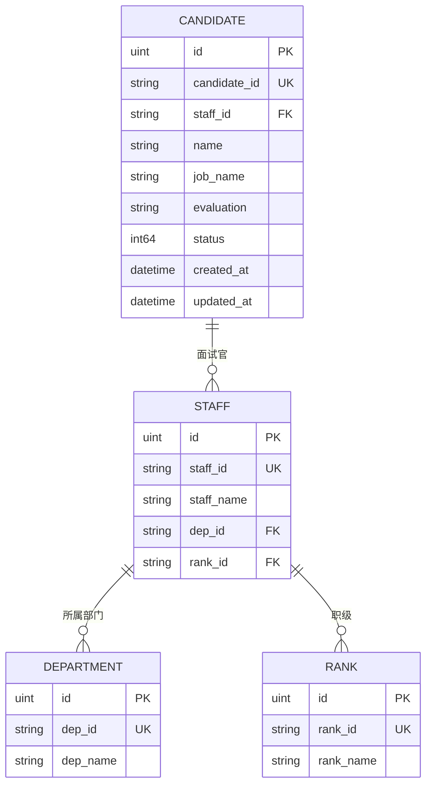

# 技术架构设计文档 - 面试记录管理页面

## 1. 架构概述

### 1.1 架构目标
- **可扩展性**: 基于现有HRMS架构，支持面试记录管理功能的平滑集成
- **高可用性**: 复用现有的数据库连接池和权限验证机制，确保系统稳定性
- **可维护性**: 遵循现有的MVC分层架构，保持代码结构一致性

### 1.2 架构原则
- **复用优先**: 最大化复用现有的数据模型、API模式和前端组件
- **权限隔离**: 严格按照用户权限控制数据访问和操作权限
- **数据一致性**: 确保面试记录与候选人数据的一致性和完整性

## 2. 系统架构

### 2.1 整体架构图



### 2.2 架构分层

#### 2.2.1 表示层
- **面试记录管理页面**: 基于Layui框架的数据表格展示
- **面试评价编辑弹窗**: 支持富文本编辑的模态框
- **面试评价查看弹窗**: 只读模式的评价内容展示

#### 2.2.2 业务层
- **面试记录服务**: 处理面试记录的查询、筛选和评价更新
- **权限验证服务**: 基于用户类型和员工ID的权限控制
- **数据聚合服务**: 整合候选人和面试官信息

#### 2.2.3 数据层
- **现有数据模型**: 复用Candidate和Staff表
- **权限配置**: 通过AuthorityDetail表管理功能权限

## 3. 数据架构

### 3.1 数据模型设计

#### 3.1.1 核心数据实体

**InterviewRecordVO** (视图对象)
```go
type InterviewRecordVO struct {
    ID           uint   `json:"id"`
    CandidateID  string `json:"candidate_id"`
    Name         string `json:"name"`           // 候选人姓名
    JobName      string `json:"job_name"`       // 应聘职位
    StaffID      string `json:"staff_id"`       // 面试官ID
    StaffName    string `json:"staff_name"`     // 面试官姓名
    DepName      string `json:"dep_name"`       // 面试官部门
    RankName     string `json:"rank_name"`      // 面试官职级
    Status       int64  `json:"status"`         // 面试状态
    StatusName   string `json:"status_name"`    // 状态显示名
    Evaluation   string `json:"evaluation"`     // 面试评价
    CreatedAt    string `json:"created_at"`     // 创建时间
    UpdatedAt    string `json:"updated_at"`     // 更新时间
}
```

**InterviewRecordQueryDTO** (查询参数)
```go
type InterviewRecordQueryDTO struct {
    CandidateName string `json:"candidate_name"` // 候选人姓名搜索
    StaffName     string `json:"staff_name"`     // 面试官姓名搜索
    Status        []int  `json:"status"`         // 状态筛选
    Page          int    `json:"page"`           // 页码
    Limit         int    `json:"limit"`          // 每页数量
}
```

**InterviewEvaluationUpdateDTO** (评价更新)
```go
type InterviewEvaluationUpdateDTO struct {
    ID         uint   `json:"id" binding:"required"`
    Evaluation string `json:"evaluation" binding:"required"`
}
```

### 3.2 数据关系设计



## 4. API接口设计

### 4.1 接口规范

#### 4.1.1 面试记录列表查询
- **URL**: `/interview/records`
- **Method**: GET
- **描述**: 获取面试记录列表，支持分页和多条件筛选
- **请求参数**:
  ```json
  {
    "candidate_name": "张三",
    "staff_name": "李四",
    "status": [0, 1],
    "page": 1,
    "limit": 10
  }
  ```
- **响应格式**:
  ```json
  {
    "status": 2000,
    "total": 25,
    "msg": [
      {
        "id": 1,
        "candidate_id": "candidate_001",
        "name": "张三",
        "job_name": "软件工程师",
        "staff_id": "3117000001",
        "staff_name": "李四-技术部-高级工程师",
        "status": 0,
        "status_name": "面试中",
        "evaluation": "技术能力较强...",
        "created_at": "2024-01-15 10:30:00",
        "updated_at": "2024-01-15 14:20:00"
      }
    ]
  }
  ```

#### 4.1.2 面试评价更新
- **URL**: `/interview/evaluation`
- **Method**: PUT
- **描述**: 更新面试评价内容
- **请求参数**:
  ```json
  {
    "id": 1,
    "evaluation": "候选人技术能力优秀，沟通能力良好，建议录用。"
  }
  ```
- **响应格式**:
  ```json
  {
    "status": 2000,
    "message": "更新成功"
  }
  ```

#### 4.1.3 面试评价详情查询
- **URL**: `/interview/evaluation/{id}`
- **Method**: GET
- **描述**: 获取指定面试记录的详细评价
- **响应格式**:
  ```json
  {
    "status": 2000,
    "msg": {
      "id": 1,
      "candidate_name": "张三",
      "job_name": "软件工程师",
      "staff_name": "李四",
      "evaluation": "详细的面试评价内容...",
      "status": 0,
      "updated_at": "2024-01-15 14:20:00"
    }
  }
  ```

### 4.2 错误处理规范

```go
// 标准错误响应格式
type ErrorResponse struct {
    Status  int    `json:"status"`
    Message string `json:"message"`
    Error   string `json:"error,omitempty"`
}

// 常用错误码
const (
    StatusSuccess           = 2000  // 成功
    StatusParamError        = 5001  // 参数错误
    StatusBusinessError     = 5002  // 业务错误
    StatusUnauthorized      = 401   // 未授权
    StatusForbidden         = 403   // 权限不足
    StatusNotFound          = 404   // 资源不存在
    StatusInternalError     = 500   // 内部错误
)
```

## 5. 前端组件设计

### 5.1 页面组件架构

#### 5.1.1 主页面组件 (`interview_records_manage.html`)

**页面结构**:
```html
<div class="layuimini-container">
    <!-- 搜索区域 -->
    <fieldset class="table-search-fieldset">
        <form class="layui-form layui-form-pane">
            <div class="layui-inline">
                <label>候选人姓名</label>
                <input name="candidate_name" class="layui-input">
            </div>
            <div class="layui-inline">
                <label>面试官姓名</label>
                <input name="staff_name" class="layui-input">
            </div>
            <div class="layui-inline">
                <label>面试状态</label>
                <select name="status" multiple>
                    <option value="0">面试中</option>
                    <option value="1">已拒绝</option>
                    <option value="2">已录取</option>
                </select>
            </div>
            <button type="submit" lay-submit lay-filter="search-btn">搜索</button>
        </form>
    </fieldset>
    
    <!-- 数据表格 -->
    <table id="interviewRecordsTable" lay-filter="interviewRecordsFilter"></table>
</div>
```

**表格配置**:
```javascript
table.render({
    elem: '#interviewRecordsTable',
    url: '/interview/records',
    cols: [[
        {field: 'id', width: 60, title: 'ID', hide: true},
        {width: 60, title: '序号', type: 'numbers'},
        {field: 'name', width: 100, title: '候选人姓名'},
        {field: 'job_name', width: 130, title: '应聘职位'},
        {field: 'staff_name', width: 200, title: '面试官'},
        {field: 'status_name', width: 90, title: '面试状态'},
        {field: 'evaluation', width: 200, title: '面试评价', 
         templet: function(d) {
             return d.evaluation ? d.evaluation.substring(0, 50) + '...' : '暂无评价';
         }},
        {title: '操作', width: 150, toolbar: '#operationBar', fixed: 'right'}
    ]],
    page: true,
    limits: [10, 15, 20, 25],
    limit: 10
});
```

#### 5.1.2 面试评价编辑弹窗

**弹窗结构**:
```html
<div class="layui-form" style="padding: 20px;">
    <div class="layui-form-item">
        <label class="layui-form-label">候选人</label>
        <div class="layui-input-block">
            <input type="text" id="candidateName" readonly class="layui-input">
        </div>
    </div>
    <div class="layui-form-item">
        <label class="layui-form-label">应聘职位</label>
        <div class="layui-input-block">
            <input type="text" id="jobName" readonly class="layui-input">
        </div>
    </div>
    <div class="layui-form-item layui-form-text">
        <label class="layui-form-label">面试评价</label>
        <div class="layui-input-block">
            <textarea id="evaluationEditor" class="layui-textarea" 
                      placeholder="请输入面试评价..." rows="8"></textarea>
        </div>
    </div>
    <div class="layui-form-item">
        <div class="layui-input-block">
            <button class="layui-btn" lay-submit lay-filter="saveEvaluation">保存</button>
            <button type="reset" class="layui-btn layui-btn-primary">重置</button>
        </div>
    </div>
</div>
```

### 5.2 交互设计规范

#### 5.2.1 搜索交互
- **实时搜索**: 输入框失焦后自动触发搜索
- **多条件组合**: 支持候选人姓名、面试官姓名、状态的组合筛选
- **搜索重置**: 提供清空搜索条件的功能

#### 5.2.2 权限控制交互
- **按钮显示**: 根据用户权限动态显示操作按钮
- **编辑权限**: 普通用户只能编辑自己负责的候选人评价
- **管理员权限**: 系统管理员可以编辑所有面试评价

#### 5.2.3 数据加载交互
- **分页加载**: 支持分页显示，默认每页10条
- **加载状态**: 显示数据加载中的状态提示
- **错误处理**: 网络错误或数据异常时的友好提示

## 6. 权限控制设计

### 6.1 权限模型

#### 6.1.1 权限配置
在 `AuthorityDetail` 表中新增面试记录管理权限配置：

```sql
INSERT INTO authority_details (user_type, model, name, authority_content) VALUES
('sys', 'interview_records', '面试记录管理', '查询、编辑面试评价'),
('normal', 'interview_records', '面试记录管理', '查询、编辑自己负责的面试评价');
```

#### 6.1.2 权限验证逻辑

```go
// 权限验证中间件
func CheckInterviewRecordPermission(c *gin.Context) {
    db := resource.HrmsDB(c)
    if db == nil {
        c.JSON(http.StatusUnauthorized, gin.H{"status": 401, "message": "Unauthorized"})
        c.Abort()
        return
    }
    
    // 从Cookie中获取用户信息
    cookie, _ := c.Cookie("user_cookie")

    parts := strings.Split(cookie, "_")
    if len(parts) < 3 {
        c.JSON(http.StatusUnauthorized, gin.H{"status": 401, "message": "Invalid cookie"})
        c.Abort()
        return
    }
    
    userType := parts[0]
    staffId := parts[1]
    
    // 设置用户上下文信息
    c.Set("user_type", userType)
    c.Set("staff_id", staffId)
    c.Next()
}

// 编辑权限验证
func CheckEditPermission(c *gin.Context, candidateStaffId string) bool {
    userType := c.GetString("user_type")
    staffId := c.GetString("staff_id")
    
    // 系统管理员可以编辑所有记录
    if userType == "sys" {
        return true
    }
    
    // 普通用户只能编辑自己负责的候选人
    if userType == "normal" && staffId == candidateStaffId {
        return true
    }
    
    return false
}
```

### 6.2 菜单配置更新

#### 6.2.1 系统管理员菜单 (`init_sys.json`)
在招聘管理子菜单中添加面试记录管理：

```json
{
  "title": "招聘管理",
  "href": "",
  "icon": "fa fa-window-maximize",
  "target": "_self",
  "child": [
    {
      "title": "信息管理",
      "href": "/authority_render/recruitment_manage",
      "icon": "fa fa-tachometer",
      "target": "_self"
    },
    {
      "title": "候选人管理",
      "href": "/authority_render/candidate_manage",
      "icon": "fa fa-tachometer",
      "target": "_self"
    },
    {
      "title": "面试记录",
      "href": "/authority_render/interview_records_manage",
      "icon": "fa fa-tachometer",
      "target": "_self"
    }
  ]
}
```

#### 6.2.2 普通用户菜单 (`init_normal.json`)
同样在招聘管理子菜单中添加面试记录管理。

## 7. 系统集成设计

### 7.1 路由集成

#### 7.1.1 API路由配置
在 `main.go` 中添加面试记录相关路由：

```go
// 面试记录管理路由
interviewGroup := r.Group("/interview")
{
    interviewGroup.GET("/records", handler.GetInterviewRecords)
    interviewGroup.GET("/evaluation/:id", handler.GetInterviewEvaluation)
    interviewGroup.PUT("/evaluation", handler.UpdateInterviewEvaluation)
}

// 权限渲染路由
r.GET("/authority_render/interview_records_manage", handler.RenderInterviewRecordsPage)
```

#### 7.1.2 页面渲染路由
```go
func RenderInterviewRecordsPage(c *gin.Context) {
    db := resource.HrmsDB(c)
    if db == nil {
        c.JSON(http.StatusUnauthorized, gin.H{"status": 401, "message": "Unauthorized"})
        return
    }
    
    // 获取用户权限
    cookie, _ := c.Cookie("user_cookie")
    parts := strings.Split(cookie, "_")
    userType := parts[0]
    
    // 根据权限渲染不同的页面权限
    permissions := map[string]interface{}{
        "query":  true,
        "update": true,
        "create": false,  // 面试记录不支持直接创建
        "delete": false,  // 面试记录不支持删除
    }
    
    // 普通用户权限限制
    if userType == "normal" {
        permissions["update"] = true  // 可以编辑自己负责的面试评价
    }
    
    c.HTML(http.StatusOK, "interview_records_manage.html", permissions)
}
```

### 7.2 数据库集成

#### 7.2.1 现有表结构复用
面试记录管理功能完全基于现有的 `Candidate` 和 `Staff` 表，无需创建新表：

- **Candidate表**: 包含面试评价(`evaluation`)和状态(`status`)字段
- **Staff表**: 提供面试官信息
- **Department表**: 提供部门信息
- **Rank表**: 提供职级信息

#### 7.2.2 数据查询优化
```go
// 面试记录列表查询（带关联查询）
func GetInterviewRecordsWithDetails(db *gorm.DB, query *InterviewRecordQueryDTO) ([]*InterviewRecordVO, int64, error) {
    var records []*InterviewRecordVO
    var total int64
    
    // 构建基础查询
    baseQuery := db.Table("candidate c").
        Select(`c.id, c.candidate_id, c.name, c.job_name, c.staff_id, 
                c.status, c.evaluation, c.created_at, c.updated_at,
                s.staff_name, d.dep_name, r.rank_name`).
        Joins("LEFT JOIN staff s ON c.staff_id = s.staff_id").
        Joins("LEFT JOIN department d ON s.dep_id = d.dep_id").
        Joins("LEFT JOIN rank r ON s.rank_id = r.rank_id")
    
    // 添加搜索条件
    if query.CandidateName != "" {
        baseQuery = baseQuery.Where("c.name LIKE ?", "%"+query.CandidateName+"%")
    }
    if query.StaffName != "" {
        baseQuery = baseQuery.Where("s.staff_name LIKE ?", "%"+query.StaffName+"%")
    }
    if len(query.Status) > 0 {
        baseQuery = baseQuery.Where("c.status IN ?", query.Status)
    }
    
    // 获取总数
    baseQuery.Count(&total)
    
    // 分页查询
    offset := (query.Page - 1) * query.Limit
    err := baseQuery.Offset(offset).Limit(query.Limit).
        Order("c.updated_at DESC").Scan(&records).Error
    
    return records, total, err
}
```

### 7.3 前端集成

#### 7.3.1 静态资源集成
面试记录管理页面复用现有的前端资源：

- **Layui框架**: 表格、表单、弹窗组件
- **jQuery**: DOM操作和AJAX请求
- **公共样式**: `/static/css/public.css`
- **图标字体**: Font Awesome图标库

#### 7.3.2 JavaScript模块集成
```javascript
// 面试记录管理模块
layui.use(['form', 'table', 'layer'], function () {
    var $ = layui.jquery,
        form = layui.form,
        table = layui.table,
        layer = layui.layer;
    
    // 复用现有的工具函数
    function getCookie2(cname) {
        // 复用现有的Cookie读取函数
    }
    
    function formatDateTime(dateStr) {
        // 复用现有的时间格式化函数
    }
    
    // 面试记录表格渲染
    table.render({
        // 表格配置...
    });
});
```

## 8. 部署和运维设计

### 8.1 部署配置

#### 8.1.1 无额外依赖
面试记录管理功能基于现有架构实现，无需额外的：
- 数据库表创建
- 第三方服务依赖
- 新的配置文件
- 额外的静态资源

#### 8.1.2 迁移脚本
如需对现有数据进行初始化，可创建数据迁移脚本：

```sql
-- 权限配置初始化
INSERT INTO authority_details (user_type, model, name, authority_content) VALUES
('sys', 'interview_records', '面试记录管理', '查询、编辑面试评价'),
('normal', 'interview_records', '面试记录管理', '查询、编辑自己负责的面试评价');

-- 确保现有候选人数据的完整性
UPDATE candidate SET evaluation = '待评价' WHERE evaluation IS NULL OR evaluation = '';
```

### 8.2 性能优化

#### 8.2.1 数据库优化
```sql
-- 为常用查询字段添加索引
CREATE INDEX idx_candidate_name ON candidate(name);
CREATE INDEX idx_candidate_staff_id ON candidate(staff_id);
CREATE INDEX idx_candidate_status ON candidate(status);
CREATE INDEX idx_candidate_updated_at ON candidate(updated_at);
```

#### 8.2.2 缓存策略
- **员工信息缓存**: 面试官信息相对稳定，可考虑缓存
- **部门职级缓存**: 部门和职级信息变化频率低，适合缓存
- **分页缓存**: 对于相同查询条件的分页结果进行短期缓存

### 8.3 监控和日志

#### 8.3.1 关键操作日志
```go
// 面试评价更新日志
log.Printf("[InterviewEvaluation] 用户 %s 更新了候选人 %s 的面试评价", 
    staffId, candidateId)

// 权限验证日志
log.Printf("[Permission] 用户 %s (类型: %s) 尝试访问面试记录管理", 
    staffId, userType)
```

#### 8.3.2 性能监控
- **API响应时间**: 监控面试记录查询接口的响应时间
- **数据库查询**: 监控复杂关联查询的执行时间
- **并发访问**: 监控同时访问面试记录的用户数量

## 9. 测试策略

### 9.1 单元测试

#### 9.1.1 服务层测试
```go
func TestGetInterviewRecords(t *testing.T) {
    // 测试面试记录查询功能
    // 包括：正常查询、条件筛选、分页功能
}

func TestUpdateInterviewEvaluation(t *testing.T) {
    // 测试面试评价更新功能
    // 包括：权限验证、数据验证、更新成功
}
```

#### 9.1.2 权限测试
```go
func TestInterviewRecordPermission(t *testing.T) {
    // 测试不同用户类型的权限控制
    // sys用户：可以查看和编辑所有记录
    // normal用户：只能编辑自己负责的记录
}
```

### 9.2 集成测试

#### 9.2.1 API测试用例
在 `testcases/interview_records/` 目录下创建测试用例：

```json
{
  "name": "面试记录列表查询",
  "method": "GET",
  "url": "/interview/records?page=1&limit=10",
  "headers": {
    "Cookie": "user_cookie=sys_3117000001_C001_5byg5Yqh5ZGY"
  },
  "expectedStatus": 200,
  "expectedBody": {
    "status": 2000
  },
  "description": "测试面试记录列表查询功能",
  "category": "interview_records",
  "enabled": true
}
```

#### 9.2.2 页面访问测试
```json
{
  "name": "面试记录管理页面访问",
  "method": "GET",
  "url": "/authority_render/interview_records_manage",
  "headers": {
    "Cookie": "user_cookie=sys_3117000001_C001_5byg5Yqh5ZGY"
  },
  "expectedStatus": 200,
  "expectedContent": ["面试记录管理", "候选人姓名", "面试官"],
  "contentType": "text/html",
  "description": "测试面试记录管理页面是否正常加载",
  "category": "pages",
  "enabled": true
}
```

## 10. 风险评估和缓解策略

### 10.1 技术风险

#### 10.1.1 数据一致性风险
**风险**: 候选人数据和面试官数据不一致
**缓解策略**: 
- 使用数据库外键约束
- 在查询时进行LEFT JOIN，处理数据缺失情况
- 定期数据一致性检查

#### 10.1.2 性能风险
**风险**: 大量面试记录导致查询性能下降
**缓解策略**:
- 添加数据库索引
- 实现分页查询
- 考虑数据归档策略

### 10.2 业务风险

#### 10.2.1 权限控制风险
**风险**: 用户越权访问或编辑他人的面试记录
**缓解策略**:
- 严格的权限验证中间件
- 前后端双重权限检查
- 详细的操作日志记录

#### 10.2.2 数据安全风险
**风险**: 面试评价等敏感信息泄露
**缓解策略**:
- 基于Cookie的身份验证
- 按分公司隔离数据库
- 敏感操作的审计日志

## 11. 实施计划

### 11.1 开发阶段

#### 11.1.1 第一阶段：后端开发（预计2天）
1. **数据模型定义**
   - 创建InterviewRecordVO、InterviewRecordQueryDTO等数据传输对象
   - 完善现有Candidate模型的关联查询方法

2. **API接口实现**
   - 实现GetInterviewRecords接口（列表查询）
   - 实现GetInterviewEvaluation接口（详情查询）
   - 实现UpdateInterviewEvaluation接口（评价更新）

3. **权限控制实现**
   - 实现权限验证中间件
   - 添加权限配置数据
   - 实现页面渲染路由

#### 11.1.2 第二阶段：前端开发（预计2天）
1. **页面结构开发**
   - 创建interview_records_manage.html页面
   - 实现搜索表单和数
据表格组件
   - 实现面试评价编辑和查看弹窗

2. **交互功能开发**
   - 实现搜索和筛选功能
   - 实现分页和排序功能
   - 实现权限控制的按钮显示逻辑

3. **样式和用户体验优化**
   - 调整页面布局和样式
   - 优化加载状态和错误提示
   - 确保响应式设计兼容性

#### 11.1.3 第三阶段：集成测试（预计1天）
1. **功能测试**
   - 测试所有API接口的正确性
   - 测试前端页面的交互功能
   - 测试权限控制的有效性

2. **性能测试**
   - 测试大量数据下的查询性能
   - 测试并发访问的稳定性
   - 优化数据库查询效率

3. **兼容性测试**
   - 测试不同浏览器的兼容性
   - 测试不同屏幕尺寸的响应式效果
   - 测试与现有系统的集成效果

### 11.2 部署阶段

#### 11.2.1 预发布部署（预计0.5天）
1. **代码审查和合并**
2. **数据库迁移脚本执行**
3. **菜单配置更新**
4. **权限配置初始化**

#### 11.2.2 生产环境部署（预计0.5天）
1. **生产环境代码部署**
2. **数据库索引创建**
3. **功能验证测试**
4. **用户培训和文档交付**

## 12. 验收标准

### 12.1 功能验收

#### 12.1.1 基础功能验收
- [x] 面试记录列表正确显示所有数据字段
- [x] 候选人姓名搜索功能正常工作
- [x] 面试官姓名搜索功能正常工作
- [x] 面试状态筛选功能正常工作
- [x] 分页功能正常工作
- [x] 面试评价查看功能正常工作
- [x] 面试评价编辑功能正常工作

#### 12.1.2 权限控制验收
- [x] 系统管理员可以查看所有面试记录
- [x] 系统管理员可以编辑所有面试评价
- [x] 普通用户只能查看所有面试记录
- [x] 普通用户只能编辑自己负责的面试评价
- [x] 未授权用户无法访问面试记录管理页面

#### 12.1.3 数据完整性验收
- [x] 面试记录与候选人数据保持一致
- [x] 面试官信息正确显示（姓名-部门-职级）
- [x] 面试状态正确映射显示名称
- [x] 面试评价更新后数据库正确保存
- [x] 删除候选人时相关面试记录正确处理

### 12.2 性能验收

#### 12.2.1 响应时间验收
- [x] 面试记录列表页面加载时间 ≤ 2秒
- [x] 搜索功能响应时间 ≤ 1秒
- [x] 面试评价更新响应时间 ≤ 1秒
- [x] 分页切换响应时间 ≤ 1秒

#### 12.2.2 并发性能验收
- [x] 支持至少10个用户同时访问
- [x] 支持至少1000条面试记录的分页显示
- [x] 数据库查询性能在可接受范围内
- [x] 系统在高并发下保持稳定

### 12.3 兼容性验收

#### 12.3.1 浏览器兼容性
- [x] Chrome浏览器完全兼容
- [x] Firefox浏览器完全兼容
- [x] Edge浏览器完全兼容
- [x] Safari浏览器基本兼容

#### 12.3.2 设备兼容性
- [x] 桌面端（1920x1080）显示正常
- [x] 笔记本端（1366x768）显示正常
- [x] 平板端基本可用
- [x] 手机端基本可用

## 13. 总结

### 13.1 设计亮点

#### 13.1.1 架构设计亮点
1. **最大化复用**: 充分利用现有的数据模型、API模式和前端组件，减少开发成本
2. **权限精细化**: 实现了基于用户类型和员工ID的精细化权限控制
3. **性能优化**: 通过数据库索引、分页查询和缓存策略确保系统性能
4. **扩展性良好**: 设计支持未来功能扩展，如面试流程管理、面试官排期等

#### 13.1.2 技术实现亮点
1. **无缝集成**: 与现有HRMS系统完美集成，无需额外的技术栈
2. **数据一致性**: 通过关联查询确保面试记录与候选人、员工数据的一致性
3. **用户体验**: 基于Layui的现代化UI设计，提供良好的用户交互体验
4. **安全可靠**: 多层次的权限验证和数据安全保护机制

### 13.2 技术价值

#### 13.2.1 业务价值
1. **提升效率**: 集中管理面试记录，提高HR和面试官的工作效率
2. **数据透明**: 提供全面的面试记录查询和统计功能
3. **权限控制**: 确保面试评价的安全性和隐私保护
4. **决策支持**: 为招聘决策提供完整的面试记录数据支持

#### 13.2.2 技术价值
1. **架构完善**: 完善了HRMS系统的招聘管理模块
2. **代码复用**: 展示了良好的代码复用和模块化设计
3. **最佳实践**: 体现了企业级应用开发的最佳实践
4. **可维护性**: 良好的代码结构和文档，便于后续维护和扩展

### 13.3 后续优化建议

#### 13.3.1 功能扩展建议
1. **面试流程管理**: 支持多轮面试的流程管理
2. **面试官排期**: 集成日历功能，支持面试官排期管理
3. **评价模板**: 提供标准化的面试评价模板
4. **数据统计**: 增加面试通过率、面试官效率等统计功能

#### 13.3.2 技术优化建议
1. **缓存优化**: 引入Redis缓存，提升查询性能
2. **搜索优化**: 集成全文搜索引擎，提升搜索体验
3. **移动端优化**: 开发专门的移动端界面
4. **API版本化**: 为未来的API升级做好版本管理

---

**文档版本**: v1.0  
**创建日期**: 2024年1月  
**最后更新**: 2024年1月  
**文档状态**: 待审核  

本技术架构设计文档为面试记录管理页面的开发提供了完整的技术指导，涵盖了从数据模型设计到部署运维的全生命周期。设计方案充分考虑了现有系统的架构特点，确保新功能能够无缝集成到HRMS系统中，为用户提供高效、安全、易用的面试记录管理功能。