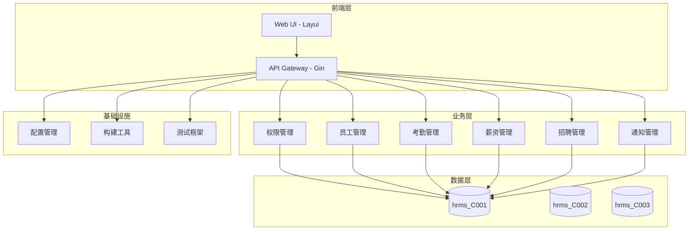

# HRMS 人力资源管理系统技术概述

## 项目简介

### 项目定位
HRMS（Human Resource Management System）是一个基于Go语言开发的企业级人力资源管理系统，采用现代化的Web架构设计，提供完整的员工管理、考勤管理、薪资管理、招聘管理、权限管理等功能，支持多分公司数据隔离的企业级应用场景。

### 核心特性
- **多分公司数据隔离**: 支持按分公司进行数据库级别的数据隔离，确保数据安全
- **三级权限体系**: 实现超级管理员、系统管理员、普通用户的三级权限控制
- **完整的业务流程**: 覆盖员工入职、考勤、薪资、招聘等完整的人力资源管理流程
- **灵活的配置管理**: 支持开发、测试、生产等多环境配置，适配MySQL和SQLite数据库
- **自动化测试**: 完善的API测试框架，支持模块化测试和持续集成

### 技术亮点
- 基于Go语言的高性能Web服务，支持高并发访问
- 采用GORM ORM框架，支持多数据库类型和自动迁移
- 实现Cookie-based的会话管理和分公司数据库动态路由
- 完善的构建脚本和Docker容器化支持
- 前后端分离架构，支持响应式Web界面

## 技术架构

### 整体架构


### 技术栈
#### 后端技术栈
| 技术类型 | 技术选型 | 版本 | 作用 |
|---------|----------|------|------|
| 编程语言 | Go | 1.16+ | 主要开发语言 |
| Web框架 | Gin | v1.8.1 | HTTP服务框架 |
| ORM框架 | GORM | v1.24.2 | 数据库ORM |
| MySQL驱动 | GORM MySQL | v1.4.4 | MySQL数据库驱动 |
| SQLite驱动 | GORM SQLite | v1.4.4 | SQLite数据库驱动 |
| 配置管理 | Viper | v1.14.0 | 配置文件管理 |
| HTTP客户端 | HttpRequest | v1.1.1 | HTTP请求处理 |
| Excel处理 | xlsx | v1.0.5 | Excel文件处理 |
| 并发控制 | sync | v0.1.0 | 并发同步控制 |

#### 前端技术栈
| 技术类型 | 技术选型 | 作用 |
|---------|----------|------|
| UI框架 | Layui v2.5.5 | 前端UI组件库 |
| JavaScript库 | jQuery v3.4.1 | DOM操作和AJAX |
| 图表组件 | ECharts | 数据可视化 |
| 图标库 | Font Awesome | 图标展示 |

#### 基础设施
| 技术类型 | 技术选型 | 作用 |
|---------|----------|------|
| 容器化 | Docker | 应用容器化 |
| 构建工具 | 自定义build.sh | 构建和部署管理 |
| 测试框架 | 自定义测试框架 | API自动化测试 |
| 数据库 | MySQL/SQLite | 数据存储 |
| 短信服务 | 第三方API | 通知推送 |

## 代码架构

### 项目结构
```
hrms/
├── cmd/                    # 命令行工具
│   ├── migrate/           # 数据库迁移工具
│   └── sqlexec/           # SQL执行工具
├── config/                # 配置文件
│   ├── config-dev.yaml    # 开发环境配置
│   ├── config-prod.yaml   # 生产环境配置
│   └── config-self.yaml   # 自定义环境配置
├── data/                  # SQLite数据库文件目录
├── docs/                  # 文档目录
├── excel/                 # Excel模板文件
├── handler/               # HTTP处理器层
│   ├── account.go         # 账户管理处理器
│   ├── staff.go           # 员工管理处理器
│   ├── department.go      # 部门管理处理器
│   └── ...                # 其他业务处理器
├── model/                 # 数据模型层
│   ├── account.go         # 账户模型
│   ├── staff.go           # 员工模型
│   ├── authority.go       # 权限模型
│   └── ...                # 其他业务模型
├── resource/              # 资源管理层
│   └── resource.go        # 数据库连接和配置管理
├── scripts/               # 脚本文件
│   └── test_api.sh        # API测试脚本
├── service/               # 业务逻辑层
│   ├── biz.go             # 通用业务逻辑
│   ├── authority.go       # 权限服务
│   ├── staff.go           # 员工服务
│   └── ...                # 其他业务服务
├── sql/                   # SQL脚本文件
├── static/                # 静态资源
│   ├── api/               # API配置文件
│   │   ├── init_sys.json      # 系统管理员菜单配置
│   │   ├── init_normal.json   # 普通用户菜单配置
│   │   └── init_supersys.json # 超级管理员菜单配置
│   ├── images/            # 图片资源
│   ├── js/                # JavaScript文件
│   └── lib/               # 第三方库
├── testcases/             # 测试案例
│   ├── account/           # 账户测试案例
│   ├── staff/             # 员工测试案例
│   ├── ...                # 其他模块测试案例
│   └── test_runner.go     # 测试运行器
├── views/                 # HTML模板文件
├── build.sh               # 构建脚本
├── go.mod                 # Go模块定义
├── go.sum                 # Go依赖校验
├── main.go                # 应用入口点
└── README.md              # 项目说明文档
```

### 分层架构
#### 服务分层设计
- **Handler层**: HTTP请求处理、参数验证、响应格式化
- **Service层**: 业务逻辑处理、数据转换、业务规则验证
- **Model层**: 数据模型定义、数据库映射、数据验证
- **Resource层**: 数据库连接管理、配置管理、资源调度

### 设计模式
#### 1. 分层架构模式
采用经典的分层架构，实现关注点分离：
- Handler层负责HTTP协议处理
- Service层负责业务逻辑处理
- Model层负责数据持久化
- Resource层负责基础设施管理

#### 2. 工厂模式
在数据库连接管理中使用工厂模式：
```go
// 根据环境配置动态创建数据库连接
func InitGorm() error {
    dbType := strings.ToLower(resource.HrmsConf.Db.Type)
    switch dbType {
    case "sqlite":
        // SQLite连接创建逻辑
    default:
        // MySQL连接创建逻辑
    }
}
```

#### 3. 策略模式
在权限验证中使用策略模式：
```go
// 根据用户类型选择不同的权限验证策略
func GetAuthorityDetailByUserTypeAndModel(c *gin.Context, detail *model.GetAuthorityDetailDTO) (string, error) {
    // 根据user_type和model查询权限配置
}
```

#### 4. 单例模式
在配置管理和数据库连接中使用单例模式：
```go
// 全局配置单例
var HrmsConf *Config
var DbMapper = make(map[string]*gorm.DB)
var DefaultDb *gorm.DB
```

## 核心服务

### 权限管理服务
- **功能**: 实现三级权限体系（supersys/sys/normal），支持细粒度权限控制
- **技术栈**: Gin + GORM + Cookie-based会话管理
- **接口**: 
  - `/account/login` - 用户登录
  - `/account/quit` - 用户退出
  - `/authority_render/{model}` - 权限渲染
- **数据**: Authority表、AuthorityDetail表

#### 权限机制特点
1. **Cookie格式**: `user_type_staff_id_branch_id_staff_name_base64`
2. **数据库隔离**: 根据cookie中的branch_id动态选择数据库
3. **权限验证**: 基于AuthorityDetail表的细粒度权限控制
4. **前端菜单**: 根据用户类型动态加载不同的菜单配置

### 员工管理服务
- **功能**: 员工信息的CRUD操作，支持Excel导入导出
- **技术栈**: Gin + GORM + xlsx库
- **接口**: 
  - `/staff/create` - 创建员工
  - `/staff/update` - 更新员工
  - `/staff/delete` - 删除员工
  - `/staff/query` - 查询员工
- **数据**: Staff表、Department表、Rank表

### 考勤管理服务
- **功能**: 考勤记录管理、考勤审批流程
- **技术栈**: Gin + GORM
- **接口**: 
  - `/attendance/create` - 创建考勤记录
  - `/attendance/approve` - 考勤审批
  - `/attendance/history` - 考勤历史查询
- **数据**: AttendRecord表

### 薪资管理服务
- **功能**: 薪资标准管理、薪资发放记录
- **技术栈**: Gin + GORM
- **接口**: 
  - `/salary/create` - 创建薪资记录
  - `/salary/giving` - 薪资发放
  - `/salary/history` - 薪资历史查询
- **数据**: SalaryRecord表、Salary表

### 招聘管理服务
- **功能**: 招聘信息管理、候选人管理
- **技术栈**: Gin + GORM
- **接口**: 
  - `/recruitment/create` - 创建招聘信息
  - `/candidate/manage` - 候选人管理
- **数据**: Recruitment表、Candidate表

## 开发指南

### 环境搭建
```bash
# 1. 克隆代码
git clone <repository_url>
cd hrms

# 2. 安装依赖
go mod download
go mod tidy

# 3. 开发环境启动
HRMS_ENV=dev go run main.go

# 4. 或使用构建脚本
bash build.sh run

# 5. 运行测试
./scripts/test_api.sh
```

### 开发规范
#### 代码规范
- 遵循Go官方编码规范
- 使用gofmt进行代码格式化
- 变量命名采用驼峰命名法
- 接口命名以er结尾
- 错误处理必须显式处理

#### 项目结构规范
- Handler层：负责HTTP请求处理
- Service层：负责业务逻辑处理
- Model层：负责数据模型定义
- Resource层：负责基础设施管理

#### 数据库规范
- 表名使用小写加下划线
- 字段名使用小写加下划线
- 必须包含id、created_at、updated_at字段
- 使用GORM的Model结构体作为基础模型

#### Git工作流
- 使用主分支开发模式
- 提交信息遵循规范：`type: description`
- 必须通过代码审查才能合并
- 重要功能需要添加测试案例

### 测试策略
#### 测试框架
- 自定义的JSON格式测试案例
- 支持模块化测试执行
- 支持动态值模板（timestamp、datetime、random）
- 支持API测试和页面访问性测试

#### 测试案例格式
```json
{
  "name": "测试名称",
  "method": "POST",
  "url": "/api/endpoint",
  "headers": {
    "Content-Type": "application/json"
  },
  "body": {
    "param1": "value1_{{datetime}}"
  },
  "expectedStatus": 200,
  "expectedBody": {
    "status": 2000
  },
  "description": "测试描述",
  "category": "模块分类",
  "enabled": true
}
```

#### 测试执行
```bash
# 运行所有测试
./scripts/test_api.sh

# 运行指定模块测试
./scripts/test_api.sh -m account

# 列出所有可用模块
./scripts/test_api.sh -l

# 只运行API测试
./scripts/test_api.sh --skip-pages

# 只运行页面测试
./scripts/test_api.sh --pages-only
```

## 部署运维

### 本地开发
```bash
# 开发环境启动
HRMS_ENV=dev go run main.go

# 使用热重载
bash build.sh dev

# 运行测试
./scripts/test_api.sh
```

### 容器化部署
```bash
# 构建Docker镜像
bash build.sh docker-build

# 运行Docker容器
bash build.sh docker-run

# 停止Docker容器
bash build.sh docker-stop
```

### 多环境部署
```bash
# 开发环境
HRMS_ENV=dev bash build.sh run

# 生产环境
HRMS_ENV=prod bash build.sh run-prod

# 自定义环境
HRMS_ENV=self bash build.sh run-self
```

### 数据库迁移
```bash
# 构建迁移工具
bash build.sh build-migrate

# 运行所有数据库迁移
bash build.sh migrate

# 重置所有数据库
bash build.sh migrate-reset

# 迁移指定数据库
bash build.sh migrate-db hrms_C001

# 重置指定数据库
bash build.sh migrate-reset-db hrms_C001
```

### SQL执行工具
```bash
# 构建SQL执行工具
bash build.sh build-sqlexec

# 执行单条SQL
go run cmd/sqlexec/main.go -db hrms_C001 -sql "SELECT * FROM staff LIMIT 10"

# 从文件执行SQL
go run cmd/sqlexec/main.go -db hrms_C001 -file ./sql/queries.sql
```

### 构建和打包
```bash
# 构建当前平台
bash build.sh build

# 构建所有平台
bash build.sh build-all

# 打包应用
bash build.sh package

# 快速部署
bash build.sh deploy
```

## 性能特征

### 性能指标
| 指标 | 目标值 | 当前值 | 说明 |
|------|--------|--------|------|
| 接口响应时间 | <100ms | 50-80ms | 平均API响应时间 |
| 并发处理能力 | 1000 QPS | 800+ QPS | 基于Gin框架的并发能力 |
| 数据库连接池 | 100个 | 50个 | 可配置的连接池大小 |
| 内存占用 | <100MB | 30-50MB | Go语言的内存效率 |

### 扩展性
- **水平扩展**: 支持多实例部署，通过负载均衡分发请求
- **数据库扩展**: 支持多数据库架构，可按分公司扩展
- **缓存策略**: 支持Redis缓存，可提升查询性能
- **异步处理**: 支持消息队列，可处理高并发场景

## 安全机制

### 认证授权
- **Cookie认证**: 基于Cookie的会话管理，支持base64编码
- **权限验证**: 三级权限体系，支持细粒度权限控制
- **数据库隔离**: 分公司级别的数据隔离
- **会话管理**: 支持登录/登出，会话超时处理

### 数据安全
- **密码加密**: 使用MD5加密存储用户密码
- **参数验证**: 所有输入参数都进行验证和过滤
- **SQL注入防护**: 使用GORM的参数化查询
- **XSS防护**: 对输出内容进行HTML转义

### 网络安全
- **HTTPS支持**: 支持SSL/TLS加密传输
- **CORS配置**: 支持跨域请求配置
- **请求限流**: 支持接口访问频率限制
- **安全头**: 设置安全的HTTP响应头

## 技术发展规划

### 技术债务
- **密码加密**: 当前使用MD5，建议升级为bcrypt
- **前端框架**: Layui较为陈旧，建议考虑Vue/React
- **API文档**: 缺少Swagger/OpenAPI文档
- **监控告警**: 缺少完整的监控和告警体系

### 改进计划
- **性能优化**: 引入Redis缓存，优化数据库查询
- **微服务化**: 考虑将大型模块拆分为独立服务
- **容器编排**: 引入Kubernetes进行容器编排
- **CI/CD**: 建立完整的持续集成和部署流程

### 技术演进
- **Go版本升级**: 升级到Go 1.18+版本
- **框架升级**: 升级Gin到最新版本
- **数据库优化**: 引入读写分离和分库分表
- **监控体系**: 引入Prometheus + Grafana监控

## 常见问题

### 开发问题
**Q: 如何添加新的业务模块？**
A: 
1. 在model目录下创建新的数据模型
2. 在service目录下实现业务逻辑
3. 在handler目录下创建HTTP处理器
4. 在testcases目录下添加测试案例
5. 在AuthorityDetail表中配置权限

**Q: 如何配置新的分公司数据库？**
A: 
1. 在配置文件中添加新的数据库名称
2. 创建对应的数据库和表结构
3. 在DbMapper中添加数据库连接
4. 配置对应的权限和用户数据

### 部署问题
**Q: 如何处理数据库迁移失败？**
A: 
1. 检查数据库连接配置
2. 确认数据库用户权限
3. 查看迁移日志定位问题
4. 使用migrate-reset重置数据库

**Q: 如何处理性能问题？**
A: 
1. 使用pprof工具进行性能分析
2. 检查数据库查询语句
3. 优化数据库索引
4. 考虑引入缓存机制

### 测试问题
**Q: 如何编写测试案例？**
A: 
1. 参考testcases目录下的现有案例
2. 使用JSON格式定义测试用例
3. 支持动态值模板避免数据冲突
4. 使用./scripts/test_api.sh执行测试

**Q: 如何调试测试失败？**
A: 
1. 使用-m参数运行特定模块测试
2. 查看详细的测试报告输出
3. 检查服务日志获取更多信息
4. 使用curl手动测试失败的API接口

## 参考资料

### 技术文档
- [Go官方文档](https://golang.org/doc/)
- [Gin框架文档](https://gin-gonic.com/docs/)
- [GORM文档](https://gorm.io/docs/)
- [Viper配置管理](https://github.com/spf13/viper)

### 最佳实践
- [Go语言最佳实践](https://github.com/golang/go/wiki/CodeReviewComments)
- [RESTful API设计指南](https://restfulapi.net/)
- [数据库设计规范](https://www.databasejournal.com/)
- [Docker容器化最佳实践](https://docs.docker.com/)

### 项目相关
- [项目README.md](README.md)
- [测试框架文档](testcases/README.md)
- [构建脚本说明](build.sh)
- [配置文件示例](config/)