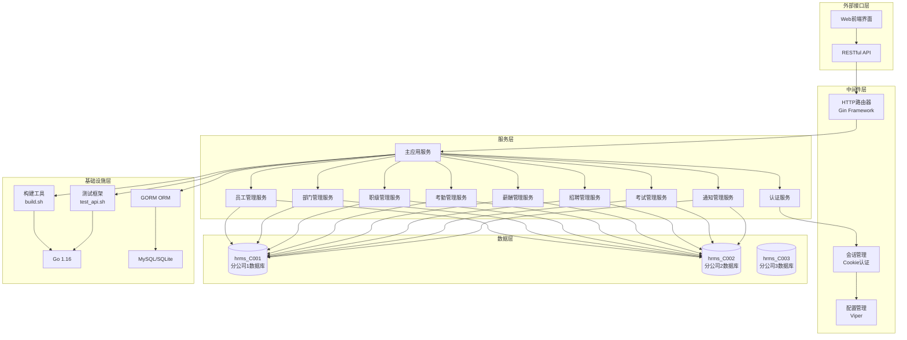
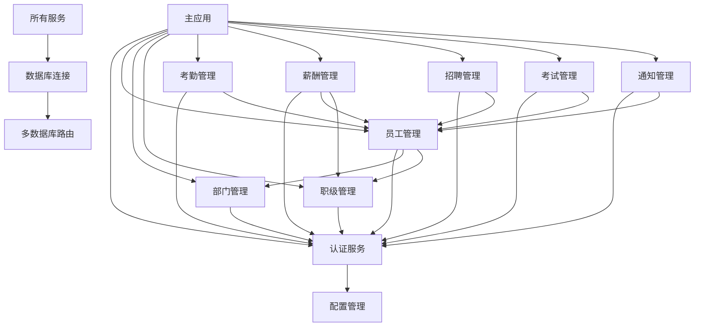

# HRMS 总体架构分析

## 概览
HRMS（Human Resource Management System）是一个基于Go语言开发的人力资源管理系统，采用单体架构设计，支持多分公司数据隔离。系统主要面向企业的人力资源管理需求，提供员工管理、部门管理、考勤管理、薪酬管理、招聘管理、考试管理等核心功能。

**系统定位**：企业级人力资源管理系统
**业务目标**：为企业提供完整的人力资源管理解决方案，支持多分公司独立运营
**技术特征**：Go语言单体应用、多租户架构、RBAC权限控制、前后端分离

## 系统架构图

## 架构分层详解

### 外部接口层
**Web前端界面**：
- 基于HTML + CSS + JavaScript的传统Web应用
- 使用Layui前端框架构建用户界面
- 支持响应式设计，适配不同设备
- 静态资源管理：CSS、JavaScript、图片等

**RESTful API**：
- 基于Gin框架的HTTP路由
- 支持GET、POST、PUT、DELETE等HTTP方法
- JSON格式的数据交换
- 统一的错误处理和响应格式

### 服务层
**主应用服务**：
- 单体应用架构，所有功能模块集成在一个进程中
- 统一的入口点：[`main.go`](main.go:1)
- 模块化的功能组织，便于维护和扩展

**核心业务服务**：
- **认证服务**：用户登录、权限验证、会话管理
- **员工管理服务**：员工信息CRUD、员工关系管理
- **部门管理服务**：部门信息维护、组织架构管理
- **职级管理服务**：职级体系管理、薪资等级配置
- **考勤管理服务**：考勤记录、考勤统计、考勤审批
- **薪酬管理服务**：工资计算、工资发放、工资历史
- **招聘管理服务**：招聘信息发布、候选人管理
- **考试管理服务**：考试安排、成绩管理
- **通知管理服务**：系统通知、消息推送

### 中间件层
**HTTP路由器**：
- 使用Gin框架实现高性能HTTP路由
- 支持路由分组，按功能模块组织
- 中间件支持：日志、跨域、认证等

**会话管理**：
- 基于Cookie的认证机制
- Cookie格式：`{userType}_{staffId}_{branchId}_{encodedStaffName}`
- 支持三种用户类型：supersys（超级管理员）、sys（系统管理员）、normal（普通用户）
- 自动会话过期和清理机制

**配置管理**：
- 使用Viper进行配置文件管理
- 支持多环境配置：dev、test、prod、self
- YAML格式的配置文件
- 热重载配置支持

### 数据层
**多租户数据库架构**：
- 每个分公司使用独立的数据库实例
- 数据库命名规范：`hrms_{branchId}`
- 支持MySQL和SQLite两种数据库类型
- 通过[`resource.HrmsDB()`](resource/resource.go:31)实现数据库连接路由

**数据模型**：
- **员工模型**：[`model.Staff`](model/staff.go:8) - 员工基本信息、薪资、部门关系
- **部门模型**：[`model.Department`](model/department.go:18) - 部门信息、组织架构
- **职级模型**：[`model.Rank`](model/rank.go:18) - 职级体系、薪资等级
- **权限模型**：[`model.Authority`](model/account.go:13) - 用户认证信息
- **权限详情模型**：[`model.AuthorityDetail`](model/authority.go:3) - 细粒度权限配置
- **考勤模型**：[`model.AttendanceRecord`](model/attendance.go:18) - 考勤记录
- **薪酬模型**：[`model.Salary`](model/salary.go:18) - 薪酬配置
- **招聘模型**：[`model.Recruitment`](model/recruitment.go:18) - 招聘信息
- **候选人模型**：[`model.Candidate`](model/candidate.go:18) - 候选人信息
- **考试模型**：[`model.Example`](model/example.go:18) - 考试信息
- **考试分数模型**：[`model.ExampleScore`](model/example_score.go:18) - 考试成绩

### 基础设施层
**开发环境**：
- Go 1.16+ 开发语言
- GORM ORM框架
- Gin Web框架
- Viper配置管理

**构建工具**：
- [`build.sh`](build.sh:1) - 综合构建脚本，替代Makefile
- 支持多平台构建：Linux、Windows、macOS
- Docker容器化支持
- 数据库迁移工具：[`cmd/migrate/main.go`](cmd/migrate/main.go:1)
- SQL执行工具：[`cmd/sqlexec/main.go`](cmd/sqlexec/main.go:1)

**测试框架**：
- [`scripts/test_api.sh`](scripts/test_api.sh:1) - API测试脚本
- 支持模块化测试
- 页面访问性测试
- 动态值模板支持，避免测试数据冲突

## 技术栈总览

| 层级 | 技术组件 | 版本/规格 | 作用 |
|------|----------|-----------|------|
| **前端层** | HTML/CSS/JavaScript | - | 用户界面展示 |
| | Layui | v2.5.5 | 前端UI框架 |
| | jQuery | v3.4.1 | JavaScript库 |
| **服务层** | Go | 1.16+ | 后端开发语言 |
| | Gin Framework | - | HTTP Web框架 |
| | GORM | - | ORM框架 |
| **中间件层** | Viper | - | 配置管理 |
| | Cookie | - | 会话管理 |
| | Base64 | - | 数据编码 |
| **数据层** | MySQL | 5.7+ | 主数据库 |
| | SQLite | 3.x | 轻量级数据库 |
| | GORM | - | 数据库操作 |
| **基础设施层** | Docker | - | 容器化部署 |
| | Bash | - | 构建脚本 |
| | Git | - | 版本控制 |

## 服务依赖关系

## 数据流架构

### 认证数据流
1. **用户登录**：
   - 前端提交登录表单 → [`handler/account.go:Login()`](handler/account.go:20)
   - 验证用户名密码 → 查询[`model.Authority`](model/account.go:13)
   - 生成Cookie → 设置客户端Cookie
   - 返回登录成功响应

2. **权限验证**：
   - 每次请求 → [`resource.HrmsDB()`](resource/resource.go:31)
   - 解析Cookie → 获取分公司ID和用户类型
   - 数据库连接路由 → 选择对应分公司数据库
   - 返回数据库连接或拒绝访问

### 业务数据流
1. **员工管理数据流**：
   - 员工信息CRUD → [`handler/staff.go`](handler/staff.go:1)
   - 业务逻辑处理 → [`service/staff.go`](service/staff.go:1)
   - 数据持久化 → [`model.Staff`](model/staff.go:8)
   - 数据库操作 → GORM → 分公司数据库

2. **多租户数据隔离**：
   - 请求到达 → Cookie解析 → 分公司ID提取
   - 数据库连接映射 → [`resource.DbMapper`](resource/resource.go:21)
   - 数据操作 → 指定分公司数据库
   - 响应返回 → 数据隔离保证

### 前端菜单数据流
1. **菜单加载**：
   - 用户登录成功 → 根据用户类型加载对应配置
   - `supersys` → [`static/api/init_supersys.json`](static/api/init_supersys.json:1)
   - `sys` → [`static/api/init_sys.json`](static/api/init_sys.json:1)
   - `normal` → [`static/api/init_normal.json`](static/api/init_normal.json:1)
   - 前端渲染 → 动态菜单生成

## 权限架构

### 三级权限体系
1. **supersys（超级管理员）**：
   - 拥有系统管理权限
   - 可管理所有分公司
   - 权限范围：部门管理、职级管理、员工管理、权限管理、管理员管理

2. **sys（系统管理员）**：
   - 拥有单个分公司的完整管理权限
   - 权限范围：员工管理、通知管理、考勤管理、薪酬管理、招聘管理、考试管理

3. **normal（普通用户）**：
   - 拥有有限的业务操作权限
   - 权限范围：个人信息管理、通知查看、考勤上报、薪酬查看、招聘参与

### 权限数据模型
- **Authority表**：存储用户基本权限信息（staff_id, user_type）
- **AuthorityDetail表**：存储细粒度权限配置（user_type, model, authority_content）

### 权限验证机制
1. **Cookie鉴权**：
   - 格式：`user_cookie=用户类型_员工工号_分公司ID_员工姓名(base64编码)`
   - 通过[`resource.HrmsDB()`](resource/resource.go:31)解析cookie获取数据库连接
   - Cookie格式验证：必须包含至少3个下划线分隔的部分

2. **数据库连接鉴权**：
   - 所有业务操作前必须通过[`resource.HrmsDB(c)`](resource/resource.go:31)获取数据库连接
   - 连接失败返回[`resource.ErrUnauthorized`](resource/resource.go:15)错误
   - 支持多分公司数据库隔离，通过[`DbMapper`](resource/resource.go:21)管理

## 架构优势

### 1. 多租户架构设计
- **数据隔离**：每个分公司使用独立数据库，确保数据安全
- **扩展性**：新增分公司只需创建新数据库，无需修改应用代码
- **性能优化**：数据库级别的隔离，避免数据量过大影响性能

### 2. 灵活的权限体系
- **三级权限**：supersys、sys、normal，满足不同层级管理需求
- **细粒度控制**：AuthorityDetail表支持模块级权限配置
- **动态菜单**：根据用户类型动态加载前端菜单配置

### 3. 完善的构建和测试体系
- **综合构建脚本**：[`build.sh`](build.sh:1)提供完整的构建、部署、测试功能
- **多环境支持**：dev、test、prod、self环境配置
- **自动化测试**：[`scripts/test_api.sh`](scripts/test_api.sh:1)支持API和页面测试
- **数据库工具**：迁移工具和SQL执行工具，便于数据库管理

### 4. 技术选型合理
- **Go语言**：高性能、并发性好，适合企业级应用
- **Gin框架**：轻量级、高性能，提供完整的Web功能
- **GORM ORM**：简化数据库操作，支持多种数据库
- **单体架构**：部署简单，维护成本低，适合中小型企业

## 潜在改进点

### 1. 架构层面
- **微服务化**：随着业务增长，可考虑将核心模块拆分为独立服务
- **缓存层**：引入Redis等缓存系统，提高查询性能
- **消息队列**：使用消息队列处理异步任务，如通知发送、报表生成
- **API网关**：引入API网关统一管理API访问、限流、监控

### 2. 安全层面
- **密码加密**：当前使用MD5加密，建议升级为bcrypt等更安全的加密算法
- **JWT令牌**：考虑使用JWT替代Cookie，提高安全性
- **HTTPS支持**：强制使用HTTPS，确保数据传输安全
- **审计日志**：增加详细的操作审计日志，便于安全追踪

### 3. 性能层面
- **数据库优化**：建立合适的索引，优化查询性能
- **连接池**：优化数据库连接池配置，提高并发处理能力
- **静态资源CDN**：将静态资源部署到CDN，提高访问速度
- **前端优化**：考虑使用现代前端框架，提升用户体验

### 4. 运维层面
- **容器化部署**：完善Docker配置，支持Kubernetes部署
- **监控告警**：引入Prometheus、Grafana等监控工具
- **日志管理**：集中化日志管理，便于问题排查
- **自动化部署**：建立CI/CD流水线，实现自动化部署

### 5. 开发体验
- **API文档**：集成Swagger等API文档生成工具
- **代码规范**：引入代码格式化、静态检查工具
- **单元测试**：增加单元测试覆盖率，提高代码质量
- **开发环境**：提供标准化的开发环境配置

## 总结

HRMS系统采用了成熟的技术栈和合理的架构设计，特别适合中小型企业的多分公司人力资源管理需求。系统的多租户架构、三级权限体系、完善的构建测试工具都是其显著优势。随着业务的发展，系统可以通过微服务化、引入缓存、优化安全等方式持续演进，满足更大规模的应用需求。