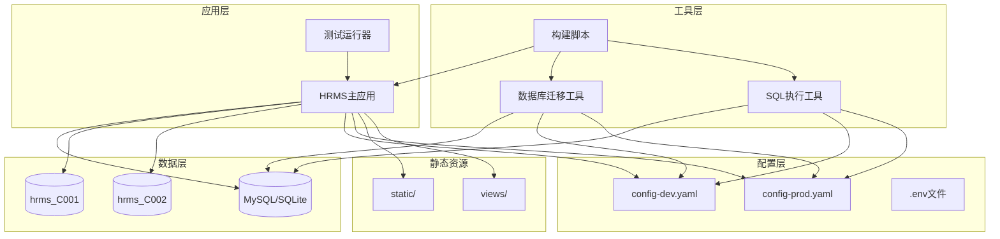

# HRMS 服务依赖关系分析

## 服务清单
| 服务名称 | 端口 | 部署类型 | 核心职责 |
|---------|------|----------|----------|
| HRMS主应用 | 8888 | 单体应用 | 人力资源管理系统的核心业务逻辑处理 |
| 数据库迁移工具 | - | 命令行工具 | 数据库结构迁移和版本管理 |
| SQL执行工具 | - | 命令行工具 | 数据库查询和批量操作 |
| 测试运行器 | 8889 | 命令行工具 | API测试和页面访问性测试 |

## 依赖关系矩阵


## 详细依赖分析

### HRMS主应用
#### 依赖的服务
- **数据库**: MySQL/SQLite，支持多租户架构（hrms_C001, hrms_C002）
- **配置文件**: config-dev.yaml（开发环境）、config-prod.yaml（生产环境）
- **静态资源**: static/目录下的CSS、JS、图片等前端资源
- **视图模板**: views/目录下的HTML页面模板

#### 被依赖情况
- **测试运行器**: 依赖主应用提供HTTP服务进行API测试
- **构建脚本**: 依赖主应用源码进行编译和打包

#### 配置依赖
- **环境变量**: HRMS_ENV（运行环境控制）
- **配置中心**: 基于Viper的配置管理系统
- **Cookie认证**: 基于cookie的用户身份验证机制

### 数据库迁移工具
#### 依赖的服务
- **数据库**: 支持MySQL和SQLite的连接和操作
- **配置文件**: 读取环境配置获取数据库连接信息
- **GORM框架**: 用于数据库模型迁移

#### 被依赖情况
- **构建脚本**: 通过build.sh脚本调用进行数据库迁移
- **部署流程**: 作为部署前的重要步骤执行

### SQL执行工具
#### 依赖的服务
- **数据库**: 支持直接SQL操作和批量执行
- **配置文件**: 获取数据库连接参数
- **交互式界面**: 提供命令行交互功能

#### 被依赖情况
- **构建脚本**: 通过build.sh脚本调用进行SQL操作
- **运维管理**: 用于数据库维护和调试

### 测试运行器
#### 依赖的服务
- **HRMS主应用**: 作为测试目标提供HTTP服务
- **测试案例**: testcases/目录下的JSON格式测试用例
- **HTTP客户端**: 用于发送HTTP请求和验证响应

#### 被依赖情况
- **测试脚本**: scripts/test_api.sh调用执行自动化测试
- **CI/CD流程**: 作为持续集成的重要环节

### 构建脚本
#### 依赖的服务
- **Go编译器**: 用于编译Go源码
- **Docker**: 用于容器化构建和部署
- **Git**: 用于版本信息和构建时间戳

#### 被依赖情况
- **开发流程**: 开发人员使用进行本地构建和测试
- **部署流程**: 运维人员使用进行生产环境部署

## 服务调用链分析

### 典型业务流程
1. **用户登录流程**:
   ```
   浏览器 → HRMS主应用(/views/login.html) → 数据库验证 → Cookie设置
   ```

2. **员工管理流程**:
   ```
   前端页面 → HRMS主应用(/staff/*) → 业务逻辑层(service/staff.go) → 数据库操作 → 返回结果
   ```

3. **数据库迁移流程**:
   ```
   构建脚本 → 数据库迁移工具 → GORM框架 → 数据库结构更新
   ```

4. **测试执行流程**:
   ```
   测试脚本 → 测试运行器 → HRMS主应用 → 数据库 → 验证响应
   ```

### 关键路径分析
1. **认证路径**: Cookie解析 → 数据库连接验证 → 权限检查 → 业务处理
2. **数据路径**: HTTP请求 → Handler层 → Service层 → Model层 → 数据库
3. **静态资源路径**: 文件系统读取 → HTTP响应 → 前端渲染

## 依赖风险评估

### 高风险依赖
1. **数据库单点故障**
   - 风险: 所有业务操作依赖数据库，数据库故障导致系统完全不可用
   - 影响: 高，影响所有业务功能
   - 建议: 实施数据库主从复制和读写分离

2. **配置文件依赖**
   - 风险: 配置文件错误或缺失导致应用启动失败
   - 影响: 高，影响应用启动和运行
   - 建议: 实施配置文件验证和备份机制

### 循环依赖
1. **构建脚本与工具的循环依赖**
   - 现象: 构建脚本依赖迁移工具，迁移工具又依赖构建脚本编译
   - 解决: 通过构建顺序控制和依赖管理避免循环

### 性能瓶颈点
1. **数据库连接池**
   - 瓶颈: 多租户架构下数据库连接数可能不足
   - 优化: 实施连接池优化和连接复用

2. **静态资源服务**
   - 瓶颈: 大量静态文件请求可能影响主应用性能
   - 优化: 考虑使用CDN或独立的静态资源服务器

## 优化建议

### 架构优化
1. **微服务化改造**
   - 将单体应用拆分为独立的微服务
   - 按业务域划分：认证服务、员工服务、薪资服务等
   - 通过API网关统一入口

2. **数据库优化**
   - 实施数据库读写分离
   - 引入缓存层(Redis)减轻数据库压力
   - 考虑使用数据库中间件实现分库分表

### 依赖管理优化
1. **配置中心化**
   - 引入配置中心(如ETCD、Consul)
   - 实现配置的动态更新和版本管理
   - 减少对本地配置文件的依赖

2. **服务发现**
   - 引入服务注册和发现机制
   - 实现服务的自动发现和负载均衡
   - 提高系统的可扩展性和容错性

### 部署优化
1. **容器化部署**
   - 使用Docker容器化所有服务
   - 使用Kubernetes进行容器编排
   - 实现自动化部署和扩缩容

2. **监控和日志**
   - 引入分布式监控系统
   - 实现统一的日志收集和分析
   - 建立告警机制和故障自愈

### 测试优化
1. **测试分层**
   - 单元测试：针对核心业务逻辑
   - 集成测试：验证服务间依赖
   - 端到端测试：模拟真实用户场景

2. **测试自动化**
   - 集成到CI/CD流程
   - 实现自动化测试报告
   - 建立测试覆盖率监控

## 总结

HRMS项目当前采用单体应用架构，具有清晰的分层结构和模块化设计。系统的主要依赖集中在数据库、配置文件和静态资源上。虽然当前架构能够满足业务需求，但在可扩展性、容错性和性能方面存在优化空间。

建议逐步实施微服务化改造，引入现代化的运维工具和最佳实践，以提高系统的稳定性、可维护性和可扩展性。同时，加强监控和测试体系建设，确保系统的高可用性和质量。