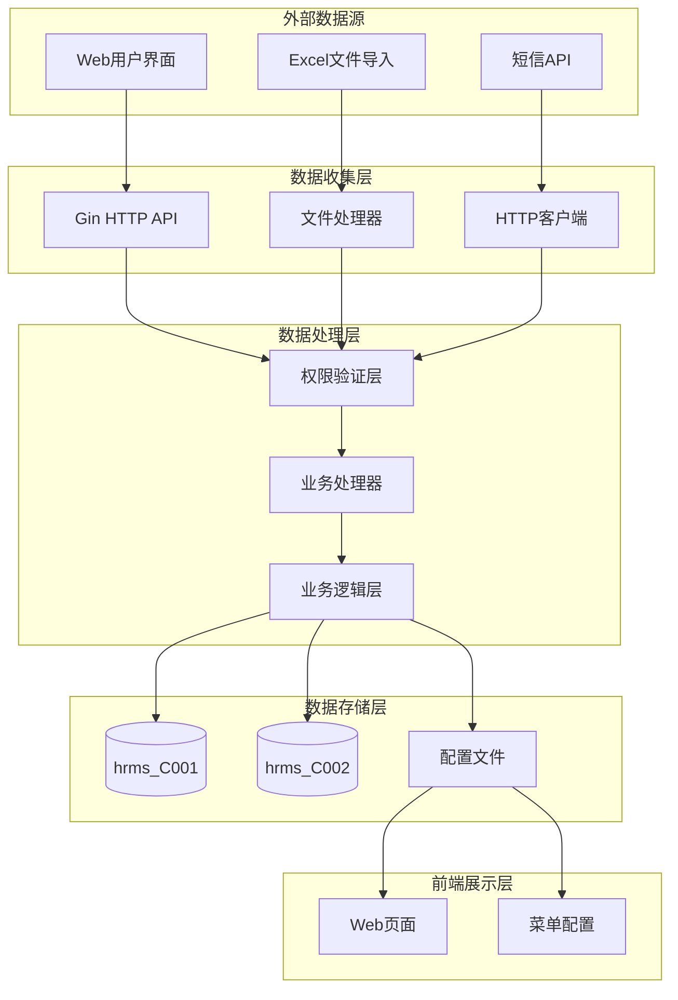

# HRMS 数据流和集成分析

## 数据源概览

### 外部数据源
| 数据源 | 类型 | 格式 | 频率 | 处理方式 |
|--------|------|------|------|----------|
| Web用户界面 | 用户输入 | JSON | 实时 | HTTP API接收 |
| Excel文件导入 | 文件导入 | Excel | 批量 | 文件解析处理 |
| 短信API | 第三方服务 | HTTP请求 | 按需 | 异步HTTP调用 |
| 静态资源文件 | 配置数据 | JSON | 静态 | 前端配置加载 |

### 内部数据源
- **数据库**: 多分公司数据库（hrms_C001, hrms_C002）存储业务数据
- **配置系统**: YAML配置文件（config-dev.yaml, config-prod.yaml）
- **前端配置**: JSON菜单配置文件（init_supersys.json, init_sys.json, init_normal.json）

## 数据流架构图


## 详细数据流分析

### 核心数据流路径

#### 路径1: 用户登录认证流
1. **数据收集**: Web UI → [`handler/account.go:Login()`](handler/account.go:33)
2. **数据验证**: 参数绑定 → 数据库查询验证
3. **数据处理**: Cookie组装 → 权限信息提取
4. **数据存储**: 会话状态存储
5. **响应返回**: 认证结果 + Cookie设置

**关键代码实现**:
```go
// Cookie组装机制
c.SetCookie("user_cookie",
    fmt.Sprintf("%v_%v_%v_%v",
        loginDb.UserType,    // 用户类型
        loginDb.StaffId,     // 员工工号
        loginR.BranchId,     // 分公司ID
        base64.StdEncoding.EncodeToString([]byte(staff.StaffName))), // base64编码姓名
    0, "/", "*", false, false)
```

#### 路径2: 员工信息管理流
1. **数据收集**: Web UI → [`handler/staff.go:CreateStaff()`](handler/staff.go:13)
2. **数据验证**: DTO绑定 → 数据完整性检查
3. **数据处理**: 事务处理 → 员工信息创建 + 权限记录创建
4. **数据存储**: PostgreSQL/SQLite持久化
5. **事件发布**: 操作结果返回

**关键代码实现**:
```go
// 事务处理确保数据一致性
err := db.Transaction(func(tx *gorm.DB) error {
    if err := tx.Create(&staff).Error; err != nil {
        return err
    }
    if err := tx.Create(&login).Error; err != nil {
        return err
    }
    return nil
})
```

#### 路径3: 考勤管理流
1. **数据收集**: Web UI → [`handler/attend.go:CreateAttendRecord()`](handler/attend.go:13)
2. **数据验证**: 参数绑定 → 业务规则验证
3. **数据处理**: 考勤记录创建 → 审批流程处理
4. **数据存储**: 考勤数据持久化
5. **审批流程**: [`handler/attend.go:ApproveAccept()`](handler/attend.go:187) / [`handler/attend.go:ApproveReject()`](handler/attend.go:206)

#### 路径4: Excel批量导入流
1. **数据收集**: 文件上传 → [`handler/staff.go:ImportStaff()`](handler/staff.go:194)
2. **数据验证**: 文件格式检查 → 数据行解析
3. **数据处理**: 并发处理 → 事务批量插入
4. **数据存储**: 批量员工信息创建
5. **错误处理**: 失败回滚 → 错误信息返回

**关键代码实现**:
```go
// 并发处理Excel导入
g.Go(func() error {
    err := service.CreateStaff(c, &dto)
    if err != nil {
        log.Printf("[ImportStaff] 创建员工失败, row = %v, err = %v", i+1, err)
        return err
    }
    return nil
})
```

### 消息传递模式

#### 同步通信
- **REST API**: 所有Handler函数通过Gin框架提供同步HTTP API
- **数据库事务**: 使用GORM事务确保ACID特性
- **权限验证**: 每个请求都通过[`resource.HrmsDB()`](resource/resource.go:30)进行同步权限检查

**同步通信模式**:
```go
// 标准的同步API处理模式
func Handler(c *gin.Context) {
    // 1. 权限验证
    db := resource.HrmsDB(c)
    if db == nil {
        c.JSON(http.StatusUnauthorized, gin.H{"status": 401, "message": "Unauthorized"})
        return
    }
    
    // 2. 数据处理
    result, err := service.ProcessData(db, data)
    
    // 3. 响应返回
    c.JSON(200, result)
}
```

#### 异步通信
- **短信通知**: [`service/biz.go:sendNoticeMsg()`](service/biz.go:137) 异步发送短信
- **Excel导入**: 使用errgroup进行并发处理
- **文件处理**: 批量数据处理的异步化

**异步通信模式**:
```go
// 短信异步发送
func sendNoticeMsg(msgType string, phone int64, content []string) {
    if phone == 0 || phone != 15521306934 {
        return // 异步过滤，不阻塞主流程
    }
    // HTTP请求发送短信
    resp, err := httpReq.Post(SMS_URL, reqJSON)
}
```

## 数据一致性策略

### 事务处理
系统采用GORM事务管理确保数据一致性：

1. **员工创建事务**: 在[`handler/staff.go:CreateStaff()`](handler/staff.go:13)中，员工信息和权限记录在同一事务中创建
2. **数据更新事务**: 所有更新操作都通过事务确保原子性
3. **批量导入事务**: Excel导入使用事务确保要么全部成功，要么全部回滚

**事务处理示例**:
```go
// 事务确保数据一致性
err := db.Transaction(func(tx *gorm.DB) error {
    // 创建员工基本信息
    if err := tx.Create(&staff).Error; err != nil {
        return err
    }
    // 创建员工权限记录
    if err := tx.Create(&login).Error; err != nil {
        return err
    }
    return nil
})
```

### 最终一致性
- **短信通知**: 采用最终一致性，主业务流程完成后异步发送
- **数据同步**: 多分公司数据通过配置文件实现最终一致性
- **缓存更新**: 无显式缓存机制，数据直接从数据库读取

### 冲突解决
- **并发控制**: 通过数据库事务和行锁解决并发冲突
- **数据验证**: 在Handler层进行数据完整性验证
- **错误处理**: 统一的错误处理机制，确保数据状态一致性

## 集成模式分析

### API集成
系统采用RESTful API设计模式：

1. **统一API入口**: 所有功能通过Gin路由统一管理
2. **标准响应格式**: 统一的JSON响应格式（status, msg, total）
3. **权限集成**: 每个API都集成权限验证机制
4. **参数验证**: 使用Gin的参数绑定和验证机制

**API集成模式**:
```go
// 标准API处理模式
func StandardHandler(c *gin.Context) {
    // 1. 参数绑定和验证
    var dto model.SomeDTO
    if err := c.ShouldBindJSON(&dto); err != nil {
        c.JSON(200, gin.H{"status": 5001, "result": err.Error()})
        return
    }
    
    // 2. 权限验证
    db := resource.HrmsDB(c)
    if db == nil {
        c.JSON(http.StatusUnauthorized, gin.H{"status": 401, "message": "Unauthorized"})
        return
    }
    
    // 3. 业务处理
    err := service.ProcessBusiness(c, &dto)
    
    // 4. 标准响应
    if err != nil {
        c.JSON(200, gin.H{"status": 5002, "result": err.Error()})
        return
    }
    c.JSON(200, gin.H{"status": 2000})
}
```

### 消息集成
系统中的消息集成主要体现在：

1. **短信通知集成**: 集成第三方短信API服务
2. **HTTP客户端集成**: 使用HttpRequest库进行外部API调用
3. **配置消息**: 通过配置文件传递系统配置信息

**消息集成示例**:
```go
// 短信服务集成
const SMS_URL = "https://api.apishop.net/communication/sms/send"

func sendNoticeMsg(msgType string, phone int64, content []string) {
    reqJSON := map[string]interface{}{
        "apiKey":     "IBIMUBn846955ab1be1d10738e67fdb7214c5fef9a626c6",
        "phoneNum":   phone,
        "templateID": templateID,
        "params":     content,
    }
    resp, err := httpReq.Post(SMS_URL, reqJSON)
}
```

### 数据集成
系统的数据集成模式：

1. **多数据库集成**: 支持MySQL和SQLite两种数据库类型
2. **多租户数据集成**: 通过分公司ID实现数据隔离
3. **Excel数据集成**: 支持Excel文件批量导入导出
4. **配置数据集成**: YAML配置文件与JSON前端配置的集成

**数据集成机制**:
```go
// 多数据库连接管理
var DbMapper = make(map[string]*gorm.DB)

// 根据Cookie中的分公司ID获取对应数据库连接
func HrmsDB(c *gin.Context) *gorm.DB {
    cookie, err := c.Cookie("user_cookie")
    if err != nil || cookie == "" {
        return nil
    }
    
    parts := strings.Split(cookie, "_")
    if len(parts) < 3 {
        return nil
    }
    
    branchId := parts[2]
    dbName := fmt.Sprintf("hrms_%v", branchId)
    if db, ok := DbMapper[dbName]; ok {
        return db
    }
    return nil
}
```

## 性能优化点

### 数据库性能优化
1. **连接池管理**: 使用GORM的连接池机制
2. **分页查询**: 所有列表查询都支持分页（[`service/biz.go:AcceptPage()`](service/biz.go:19)）
3. **索引优化**: 根据查询模式建立合适的数据库索引
4. **批量操作**: Excel导入使用批量插入优化性能

### 并发处理优化
1. **Excel并发导入**: 使用errgroup实现并发处理
2. **事务粒度控制**: 合理控制事务范围，避免长事务
3. **异步通知**: 短信通知异步化，不阻塞主业务流程

### 网络性能优化
1. **HTTP连接复用**: 使用HttpRequest库的连接复用机制
2. **数据压缩**: 可考虑启用HTTP响应压缩
3. **静态资源缓存**: 前端静态资源可配置缓存策略

## 监控和观测

### 日志监控
1. **操作日志**: 所有关键操作都有日志记录
2. **错误日志**: 统一的错误日志格式和处理
3. **性能日志**: 可添加关键操作的性能监控日志

### 权限监控
1. **访问控制**: 通过Cookie和数据库连接实现访问控制
2. **操作审计**: 所有关键操作都有操作记录
3. **异常检测**: 权限验证失败会记录异常日志

### 数据一致性监控
1. **事务监控**: 监控事务执行状态和回滚情况
2. **数据完整性**: 通过业务逻辑验证数据完整性
3. **并发冲突**: 监控并发操作可能引起的数据冲突

## 改进建议

### 架构改进
1. **引入消息队列**: 考虑引入消息队列处理异步任务，如短信通知、邮件发送等
2. **缓存层优化**: 引入Redis缓存层，缓存热点数据和会话信息
3. **微服务化**: 考虑将系统拆分为多个微服务，提高系统可扩展性

### 数据流改进
1. **事件驱动架构**: 引入事件驱动模式，实现更好的解耦
2. **数据流监控**: 增加数据流监控和追踪机制
3. **批量处理优化**: 优化批量数据处理流程，提高处理效率

### 安全性改进
1. **Cookie安全**: 增强Cookie的安全性，考虑使用HttpOnly和Secure标志
2. **数据加密**: 敏感数据在传输和存储时进行加密
3. **访问控制**: 细化权限控制，实现更细粒度的访问控制

### 性能改进
1. **数据库优化**: 优化数据库查询，添加必要的索引
2. **并发优化**: 进一步优化并发处理机制，提高系统吞吐量
3. **资源管理**: 优化系统资源使用，提高资源利用率

通过以上分析和建议，可以进一步提升HRMS系统的数据流处理能力、集成效率和整体性能。