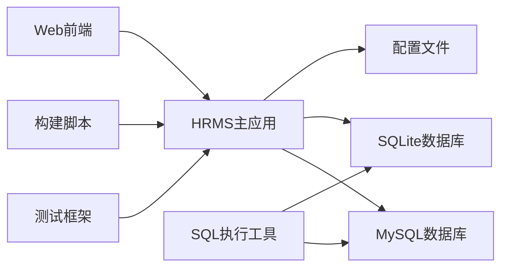

# HRMS部署分析

## 架构概览

### 服务清单
| 服务名称 | 构建策略 |
|---------|----------|
| HRMS主应用 | Go原生编译 + 多平台交叉编译 |
| 数据库服务 | MySQL/SQLite双模式支持 |
| 测试框架 | 内置Go测试框架 + 自定义测试运行器 |
| SQL执行工具 | 独立命令行工具 |

### 本地开发环境
**Docker Compose配置分析：**
项目目前没有提供Docker Compose配置文件，但通过.env文件可以看出项目支持容器化部署。主要配置包括：

- **MySQL服务**: 支持多分公司数据库隔离
- **应用服务**: 基于Gin框架的Go应用
- **环境配置**: 通过.env文件统一管理环境变量

**开发环境启动流程：**
```bash
# 1. 环境准备
chmod +x build.sh
go mod tidy

# 2. 开发模式启动
./build.sh run                    # 开发环境
HRMS_ENV=prod ./build.sh run-prod # 生产环境
```

### 服务依赖关系


## 部署配置分析

### 核心配置文件结构
```
config/
├── config-dev.yaml    # 开发环境配置
└── config-prod.yaml   # 生产环境配置
```

**开发环境配置 (config-dev.yaml):**
```yaml
gin:
  port: 8888
db:
  type: sqlite
  path: ./data
  dbName: hrms_C001,hrms_C002
```

**生产环境配置 (config-prod.yaml):**
```yaml
gin:
  port: 8888
db:
  user: root
  password: 123
  host: 127.0.0.1
  port: 3306
  dbName: hrms_C001,hrms_C002
```

### 多环境部署策略

#### 开发环境 (dev.yaml)
**特点：**
- 使用SQLite数据库，便于快速开发和测试
- 数据库文件存储在./data目录
- 支持多分公司数据库隔离（hrms_C001, hrms_C002）
- 端口：8888

**优势：**
- 无需额外数据库服务
- 数据库文件随项目一起管理
- 适合单机开发环境

#### 生产环境 (prod.yaml)
**特点：**
- 使用MySQL数据库，提供更好的性能和并发支持
- 支持远程数据库连接
- 完整的数据库认证配置
- 端口：8888

**优势：**
- 生产级数据库性能
- 支持数据库集群和主从复制
- 适合分布式部署

#### 环境切换机制
通过`HRMS_ENV`环境变量控制：
- `dev` → config-dev.yaml
- `prod` → config-prod.yaml
- `test` → config-test.yaml
- `self` → config-self.yaml

## 部署流程和最佳实践

### CI/CD集成

**构建脚本集成：**
```bash
# 多平台构建
./build.sh build-all
# 生成Linux AMD64、ARM64、Windows AMD64、macOS AMD64/ARM64版本

# 打包部署
./build.sh package
# 生成包含可执行文件、配置文件、静态资源的完整部署包

# 快速部署
./build.sh deploy
# 一键完成构建、打包流程
```

**测试自动化：**
```bash
# 完整测试套件
bash scripts/test_api.sh

# 指定模块测试
bash scripts/test_api.sh -m staff

# 页面访问性测试
bash scripts/test_api.sh --pages-only

# 性能测试
bash scripts/test_api.sh --page-perf
```

### 数据库迁移策略

**迁移工具链：**
```bash
# 构建迁移工具
./build.sh build-migrate

# 执行迁移
./build.sh migrate

# 指定数据库迁移
./build.sh migrate-db hrms_C001

# 重置数据库
./build.sh migrate-reset-db hrms_C001
```

**SQL执行工具：**
```bash
# 构建SQL执行工具
./build.sh build-sqlexec

# 交互式SQL执行
./build.sh sqlexec hrms_C001

# 单条SQL执行
./build/sqlexec -db hrms_C001 -sql "SELECT * FROM staff LIMIT 10"

# 批量SQL执行
./build/sqlexec -db hrms_C001 -file ./sql/queries.sql
```

### 常见问题

**1. 数据库连接失败**
- 问题：SQLite数据库目录权限不足
- 解决：确保data目录存在且有写权限
- 命令：`mkdir -p data && chmod 755 data`

**2. 环境配置加载失败**
- 问题：配置文件路径错误或格式问题
- 解决：检查config目录下对应环境的配置文件
- 调试：`HRMS_ENV=dev go run main.go`

**3. 端口冲突**
- 问题：8888端口被占用
- 解决：修改配置文件中的端口或停止占用进程
- 命令：`lsof -i :8888 && kill -9 <PID>`

**4. 权限验证失败**
- 问题：Cookie格式错误或数据库连接失败
- 解决：检查Cookie格式和数据库配置
- 调试：查看日志中的Cookie解析信息

### 排查方法

**1. 服务状态检查**
```bash
# 检查服务是否启动
curl http://localhost:8888/ping

# 查看进程状态
ps aux | grep hrms_app

# 检查端口占用
netstat -tlnp | grep :8888
```

**2. 日志分析**
```bash
# 查看应用日志
tail -f logs/hrms.log

# 调试模式启动
HRMS_ENV=dev go run main.go

# 性能分析
./build.sh profile
```

**3. 数据库连接测试**
```bash
# 使用SQL执行工具测试连接
./build.sh sqlexec hrms_C001

# 检查数据库表结构
./build/sqlexec -db hrms_C001 -sql "SHOW TABLES"
```

## 改进建议

### 容器优化

**1. Dockerfile缺失**
- **问题**：项目缺少Dockerfile，无法进行容器化部署
- **建议**：创建多阶段构建Dockerfile
- **示例**：
```dockerfile
# 构建阶段
FROM golang:1.16-alpine AS builder
WORKDIR /app
COPY . .
RUN go mod tidy
RUN CGO_ENABLED=0 GOOS=linux go build -o hrms_app main.go

# 运行阶段
FROM alpine:latest
WORKDIR /app
COPY --from=builder /app/hrms_app .
COPY --from=builder /app/config ./config
COPY --from=builder /app/static ./static
COPY --from=builder /app/views ./views
EXPOSE 8888
CMD ["./hrms_app"]
```

**2. Docker Compose配置**
- **问题**：缺少容器编排配置
- **建议**：创建docker-compose.yml支持多服务部署
- **包含服务**：
  - HRMS应用服务
  - MySQL数据库服务
  - Redis缓存服务（可选）
  - Nginx反向代理（可选）

### 部署优化

**1. 配置管理优化**
- **问题**：配置文件硬编码，缺乏动态配置能力
- **建议**：
  - 引入环境变量覆盖机制
  - 支持配置中心集成
  - 实现配置热重载

**2. 健康检查机制**
- **问题**：缺少完善的健康检查端点
- **建议**：
  - 扩展/ping端点功能
  - 添加数据库连接检查
  - 添加内存和CPU使用情况检查

**3. 日志管理优化**
- **问题**：日志管理简单，缺乏结构化日志
- **建议**：
  - 引入结构化日志库
  - 支持日志级别动态调整
  - 集成日志收集和分析工具

### 运维改进

**1. 监控和告警**
- **问题**：缺少监控和告警机制
- **建议**：
  - 集成Prometheus监控指标
  - 添加Grafana仪表板
  - 实现关键指标告警

**2. 备份和恢复**
- **问题**：缺少自动化备份机制
- **建议**：
  - 实现数据库自动备份
  - 支持备份文件版本管理
  - 提供一键恢复功能

**3. 安全加固**
- **问题**：安全配置较为简单
- **建议**：
  - 实现HTTPS支持
  - 加强Cookie安全配置
  - 添加API访问频率限制
  - 实现请求签名验证

**4. 性能优化**
- **问题**：缺少性能优化配置
- **建议**：
  - 实现数据库连接池
  - 添加Redis缓存层
  - 支持静态资源CDN
  - 实现Gzip压缩

### 部署架构建议

**推荐的生产环境部署架构：**
```
负载均衡层 (Nginx)
    ↓
应用层 (HRMS集群)
    ↓
缓存层 (Redis)
    ↓
数据库层 (MySQL主从)
    ↓
存储层 (文件存储/对象存储)
```

**关键特性：**
- 高可用性：多实例部署，故障自动转移
- 可扩展性：支持水平扩展和垂直扩展
- 安全性：多层安全防护，数据加密传输
- 可维护性：完善的监控、日志和备份机制
- 性能优化：多级缓存，数据库优化，静态资源优化