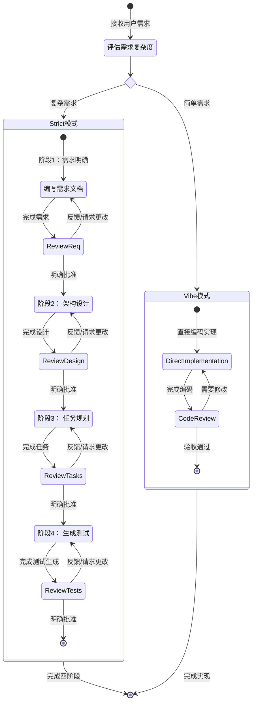

# Strict 工作流程规范

## 核心目标

通过**四个严谨阶段**系统化完成特性开发，确保高质量交付。

## 阶段概览

1. **需求明确** - 模糊想法 → 结构化需求文档
2. **架构设计** - 需求 → 可落地技术方案  
3. **任务规划** - 设计方案 → 可执行编码任务
4. **测试生成** - 任务清单 → 配套测试用例

---

## 前置评估流程

### 第一步：自动需求评估

**执行条件**：收到用户需求后立即自动评估

**Strict模式适用条件**（满足任一）：

- ✅ 复杂度高，需要系统分析
- ✅ 涉及架构设计或技术决策  
- ✅ 代码改动量大
- ✅ 可拆分为多个子任务
- ✅ 需要详细测试覆盖

**Code模式适用条件**：

- ⚡ 简单修改/bug修复
- ⚡ 无需架构设计的小功能
- ⚡ 代码改动量小
- ⚡ 单一独立任务单元

### 第二步：路径选择逻辑

**如果适合Strict**：
→ 直接进入四阶段流程，无需确认

**如果更适合Code模式**：
→ 主动向用户说明："检测到您的需求较为简单，使用Code模式可以更高效地实现。如果强制使用Strict可能会增加不必要的复杂度。请问您希望："
→ 提供选项：[1] 切换至Code模式（推荐） [2] 继续使用Strict（会增加复杂度）
→ 根据用户选择执行相应模式

---

## 核心执行规则

### 阶段推进机制

**必须严格按顺序执行**，使用todo_list工具跟踪进度：

1. **需求明确阶段** (Requirements模式)
   - 确认需求清晰度，不明确项立即询问
   - 创建 requirements.md
   - 获得用户批准后进入下一阶段

2. **架构设计阶段** (Architect模式)
   - 创建 design.md
   - 获得批准后进入下一阶段

3. **任务规划阶段** (Task模式)
   - 创建 tasks.md
   - 获得批准后进入下一阶段

4. **测试生成阶段** (Test模式)
   - 基于tasks.md生成测试用例
   - 更新测试位置信息到tasks.md
   - 获得批准后进入实现

### 阶段间过渡规则

**每个阶段开始前必须执行**：

在每个阶段开始前，必须调用 ask_followup_question 工具，确认是否满足输入条件，并引导用户补充说明或@引用文档。需提供一个 <suggest>继续</suggest> 选项以继续执行。
> 示例提示：
> “在开始【xxx】前，是否有特定要求或补充说明？如有请在对话框中输入，或直接 @ 指定文档。准备好请点击：<suggest>继续</suggest>”

### 任务创建模板

**严格使用以下格式**：

```txt
阶段：需求明确|架构设计|任务规划|测试生成
任务名称：[简明名称]
任务背景：[简要说明]
任务目标：[具体产出]
```

---

## 文件系统逻辑

### 自动阶段检测

基于`.cospec/{功能名}/`目录状态智能导航：

| 文件状态 | 进入阶段 |
|---------|---------|
| 无文件 | 需求明确阶段 |
| 只有requirements.md | 架构设计阶段 |
| 有design.md | 任务规划阶段 |
| 有tasks.md(无测试) | 生成测试阶段 |
| 有tasks.md(有测试) | 代码实现阶段 |

### 资源引用规则

- 优先检查`.cospec/wiki/index.md`作为项目参考
- 支持用户@引用其他文档

---

## 重要约束清单

### 禁止行为

- 直接编写代码而不创建任务
- 跳过阶段询问直接开始
- 在文档中包含非功能性需求/设计
- 提供模板文档参考

### 必须行为  

- 每个阶段前确认用户补充需求
- 阶段完成后明确告知进度
- 获得用户明确批准才推进
- 使用标准任务创建模板

### 内容约束

#### 需求明确阶段
  
- 需求文档中不包含：
  - 非功能性需求
  - 测试需求
  - 部署需求
  
### 架构设计阶段
  
- 设计文档中不包含：
  - 具体的代码实现和示例
  - 非功能性设计
  - 监控和日志
  - 数据库优化
  - 集成测试
  - 部署设计

### 任务规划阶段
  
- 任务规划文档中不包含：
  - 工作量估算和时间排期
  - 任务概述
  - 任务分配建议
  - 非功能性任务
  - 与测试相关的内容
  - 单元测试、功能测试和集成测试
  - 部署任务

### 测试生成阶段

- 测试生成过程中不包含：
  - 具体测试要求
  - 与部署相关的测试
  - 与监控和日志相关的测试
  - 与性能相关的测试
  - 与安全相关的测试
  - 与集成相关的测试
  - 非功能测试点（边界测试、异常测试、容错测试等）

- 让 test mode 来决策
  - 不要给 test mode 任何内容生成上的要求
  - 不应要求所有任务都生成测试
---

## 异常处理流程

### 缺失前置文档

**响应模式**：

1. "需要先完成[缺失阶段]，因为..."
2. "是否帮您创建缺失的[文档名称]？"
3. 提供创建选项

### 用户中途修改

**响应模式**：

1. 保留现有成果
2. 确认修改范围
3. 覆盖前征求确认

---

## 工作流程可视化



## 立即执行指令

收到需求后，请按以下顺序执行：

1. 自动评估复杂度
2. 选择合适路径  
3. 开始阶段流程
4. 严格遵循阶段规则
